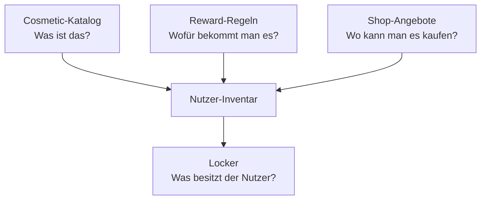

# Cosmetic-Inventar — Phase 3

> Stand: 2026-08-27. **Quelleninventar abgenommen.** Slot-Visual-QA **abgeschlossen**.  
> Status: **Rewire (kanonische Alias-IDs) umgesetzt** — Testaccounts gemerged. Produkt-Grandfathering = Zukunftsregel.  
> Aktuell nur Testaccounts → Cleanup-Pfad; Produkt-Grandfathering = Zukunftsregel.  
> Code (`config.py`, Kataloge) = **Ist nach Alias-Rewire** (Grants schreiben kanonische IDs).  
> Verwandt: [grundprogression-phase2.md](./grundprogression-phase2.md), [progression-inventory-phase3.md](./progression-inventory-phase3.md), [rewards-content.md](../rewards-content.md).

Generator: `python3 frontend/scripts/inventory_cosmetics.py` (nur lesen + Inventar-Tabellen; Soll-Abschnitte manuell).

---

## Dokumentstatus (verbindlich)

```text
fachlich geplant
Slot-IDs visuell abgenommen (2026-08-27)
Seltenheiten + kanonische IDs (Grundprogression) finalisiert
Migrationsmatrix: Rev. B — FREIGEGEBEN (2026-08-27)
Rewire: Alias-IDs umgesetzt (frame_basic / banner_soft_ice / frame_rare_trim); Test-Cleanup + Slot-QA gelaufen
Aktuell nur Testaccounts → Pfad A development_data_cleanup; Produkt-Grandfathering (Pfad B) **deferred** — nicht nötig bis echte Pre-Rewire-Live-Nutzer existieren
```

**Hinweis Ist:** Experimentelle Code-Änderungen im Repo gelten **nicht** als freigegebene Produktumsetzung.

---

## Soll-Architektur (noch nicht implementiert)

Vier Dinge sauber trennen:



Heute sind Katalog-Origin, Shop-Listing und Grant-Pfade oft **vermischt** (z. B. Early-Slot + Shop auf derselben ID).

---

## Quellenverzeichnis (belegt)

| Quelle | Pfad |
|--------|------|
| Master-Katalog | `frontend/src/features/progression/cosmetics/cosmeticCatalog.ts` |
| Phase-2 Cosmetics | `…/cosmetics/phase2Cosmetics.ts` |
| Puck/Stick PoC | `…/cosmetics/puckSkins.ts`, `stickSkins.ts` |
| Profile-Pools | `frontend/src/data/profile/{avatar,banner,emblem,sticker,coin,profileTitle}Catalog.ts` |
| Shop | `frontend/src/features/progression/shop/shopCatalog.ts` |
| Level | `frontend/src/features/progression/levelSystem.ts` |
| Achievements | `…/achievements/achievementCatalog.ts`, `phase2Achievements.ts` |
| Mastery | `…/mastery/masteryCatalog.ts` |
| Challenges | `frontend/src/content/challenges/mvpChallenges.ts` |
| Collections | `…/collections/collectionCatalog.ts` |
| Backend Slots | `backend/progression/config.py` (`EARLY_SLOT_*`, `TRACK0_*`, `FULL_GAME_*`) |
| Assets | `frontend/public/profile/**` |
| Frame-Look | `frontend/src/components/profile/AccountPillFrame.module.css` |
| Generator | `frontend/scripts/inventory_cosmetics.py` |
| Kontaktübersicht | `frontend/src/pages/DevCosmetics.tsx` · Route `/dev/cosmetics` |

---

## Kennzahlen

| Metrik | Wert |
|--------|-----:|
| Katalog-IDs (geparst) | 107 |
| Extra-IDs (Profile/Unlock außerhalb Katalog) | 5 |
| Zeilen mit ≥1 Problem | 22 |
| Shop-Listings (Preis-Map) | 30 |
| Reward-JSON-Dateien gescannt | 6 |
| Unique observed Unlock-IDs | 45 |

---


## Abnahmeurteil

Review Christoph (2026-08-26):

| Teil | Urteil |
|------|--------|
| Quelleninventar | abgenommen |
| Fehlerreport | abgenommen |
| Besitzscan | abgenommen |
| Alias-Stub | **umgesetzt** (kanonische Grants + Lese-Alias + Ownership-Merge) |
| vorgeschlagene Seltenheiten (Grundprogression-Slots) | **finalisiert** (2026-08-27) — Restinventar weiter ENTWURF |
| frühe Slotbelegung | IDs **visuell abgenommen** (`2/4/10/24/48`) |
| Migrationsmatrix Grundprogression | Rev. B — **freigegeben** (2026-08-27) |
| technisches Rewire | **Alias-Rewire umgesetzt** (Test-Cleanup + kanonische IDs); Dual-Path-Achievements im Code |

---

## Review-Korrekturen (verbindlich vor Re-Klassifikation)

1. **Starter-Set zu voll** (~25+ Items) — Dramaturgie kaputt; Start muss knapper sein.
2. **Seltenheit ≠ visuelle Intensität** — nicht wegen Asset-Typ (z. B. Emblem/Text) herunterstufen.
3. **Bezugsweg braucht exakte `primaryRewardRuleId`**, nicht nur Kategorie wie `achievement`.
4. **Bewusste Doppelquelle ist trotzdem Dual** — z. B. `sticker_matchday_first_read`: genau **eine** aktive Quelle wählen.
5. **Rarity ladder kanonisch:** Common … Legendary / **Mystic**; technisch `mystic`, Anzeige „Mystic“, Alias `mythic` → `mystic` (noch nicht im Code).
6. **`limitiert` + `permanent` widersprüchlich** — Prestige/Verfügbarkeit konsistent halten.
7. **`releasefähig` ohne Visual-QA** ist nicht belastbar.
8. **Alias nur nach visuellem Vergleich** — nicht nur aus Code-Hinweisen.
9. **Early Slots nicht aus Ist-Verdrahtung übernehmen.** Ziel: Track0 Frame → 2U Emblem → 4U Avatar → 10U Banner → … Titel später ([grundprogression-phase2.md](./grundprogression-phase2.md) Rev. 5).
10. **Cluster 2 / 3D deferred:** Masken, Pucks, Sticks, 3D-Skins — Besitz bleibt, aber **keine** Zeit in Sortierung, Slotbelegung oder Visual-QA der aktuellen Phase.

---

## Cluster 1 vs. `deferred_cluster_2`

| Cluster | Typen | Rolle jetzt |
|---|---|---|
| **1** | Avatar, Banner, Emblem, Sticker, Frame, Titel, Tagline, Mastery-Coin (2D) | Inventar / Visual-QA / künftige Slots |
| **2 (`deferred_cluster_2`)** | `puckModel`, `puckSkin`, `stickModel`, `stickSkin`, Masken (falls vorhanden) | deferred — siehe Status unten |

### Status `deferred_cluster_2` (verbindlich)

Für alle IDs mit Typ `puck*` / `stick*` / Maske:

```text
status: deferred_cluster_2
keine Visual-QA in Cluster 1
keine Aliasentscheidung
keine Slotbelegung
kein Rewire
bestehender Besitz bleibt erhalten
```

IDs (Ist-Inventar, nicht abschließend): u. a. `puck_model_classic`, `puck_model_standard_01`, `puck_skin_*`, `puck_wasteland_scrap`, `stick_model_*`, `stick_skin_*`.

Hinweis: [`progression-inventory-phase3.md`](./progression-inventory-phase3.md) darf 3D-Items in der **historischen** Bestandsaufnahme weiterhin listen — dort keine `deferred_cluster_2`-Semantik nötig. Die Steuerungsregeln für Sortierung/Slots/QA stehen **nur** in diesem Cosmetic-Doc.

---

## Minimales Starter-Bundle (Soll — noch nicht implementiert)

### Was „Starter“ heißt

```text
Starter = sofort im Locker verfügbar, ohne Session / Level / Kauf.
Technisch später: origin.type === 'starter' → isStarterCosmetic() → gilt als besessen.
```

**Account-Start (Soll):** knappes neutrales Grundset — **kein Frame**.

| Slot | ID |
|------|-----|
| Avatar | `avatar_chalk_01` |
| Banner | `banner_neutral_01` |
| Emblem | `emblem_puck_01` |
| Titel | `title_catalog_prospect` („Prospect“) |
| Tagline | `tagline_starter` („Erste Schicht.“) |
| Frame | **keiner** |

Pucks / Sticks / Masken: Cluster 2 — nicht im Starter.

### Track 0 (Soll — Onboarding-Geschenk)

Nach einmaligem Track-0-Abschluss:

```text
100 XP + 25 PUX + frame_shop_basic
primaryRewardRuleId: track0_bundle (später kanonisch frame_basic)
```

| Eigenschaft | Wert |
|---|---|
| kanonische ID | später `frame_basic` (Alias `frame_shop_basic`) |
| Seltenheit | Common |
| Intensität | 2/5 |
| Prestige | standard |
| Verfügbarkeit | permanent |
| Primärquelle | `track0_bundle` |
| Shop | Listing beim Rewire entfernen |
| wiederholbar | nein |

Surplus ehemalige Starter (z. B. `avatar_ice_01`, `emblem_arrow_01`) → Early Slots / Shop-Filler laut Slot-Tabelle unten — **nicht** parallel starter.

### Kaputte / ausgemusterte Cosmetics (Soll)

Nicht: „aus Alt-Accounts entfernt.“

```text
status: deprecated_hidden
kein neuer Grant
nicht neu ausrüstbar
bestehender Besitz bleibt technisch erhalten
gegebenenfalls Ersatzmapping (z. B. Slot-Set → high_slot)
```

Betroffene IDs (QA): `avatar_zamboni`, `banner_zamboni_shift`, `banner_property_of_the_slot`, `emblem_zamboni`, `emblem_slot_resident`, `sticker_fresh_sheet`, `sticker_slot` — Ersatz wo sinnvoll: `sticker_high_slot` / `emblem_high_slot` / `banner_high_slot`.

Wenn bisher nur Testaccounts betroffen waren: Aufräumen nur als **`development_data_cleanup`**, keine Produkt-Migrationsregel.

---

## Kontaktübersicht

Dev-Route **`/dev/cosmetics`** (hinter `DevRouteGuard`).

- **Cluster 1:** Avatare / Banner / Embleme / Sticker / Coins (SVG), Frames (CSS), Titel / Taglines (Text)
- **Cluster 2:** Puck/Stick-PoC nur als ID-Liste markiert `deferred_cluster_2` — nicht Teil der aktuellen Visual-QA

Sichtprüfung vor Re-Klassifikation und Alias-Entscheidungen: **nur Cluster 1**.

---
## Vollständige Inventar-Tabelle

Ist-Tabelle (Quelleninventar) — **abgenommen**. Soll-Klassifikation unten ist Entwurf und **nicht freigegeben**.

| ID | Typ | Asset | Seltenheit | Quellen (Ist) | Shop | Collection | Besitz möglich | Observed | Probleme |
|---|---|---|---|---|---|---|---|---:|---|
| `avatar_aurora_01` | avatar | vorhanden | mythic | shop:shop_avatar_aurora | ja (2400 PUX) | – | ja | 0 | – |
| `avatar_blueline_01` | avatar | vorhanden | rare | shop:shop_avatar_blueline | ja (640 PUX) | – | ja | 0 | – |
| `avatar_chalk_01` | avatar | vorhanden | common | starter | nein | – | ja | 6 | – |
| `avatar_crest_01` | avatar | vorhanden | common | starter | nein | – | ja | 6 | – |
| `avatar_goldpuck_01` | avatar | vorhanden | legendary | shop:shop_avatar_goldpuck | ja (1600 PUX) | – | ja | 0 | – |
| `avatar_ice_01` | avatar | vorhanden | common | starter | nein | – | ja | 6 | – |
| `avatar_net_01` | avatar | vorhanden | common | starter | nein | – | ja | 6 | – |
| `avatar_night_circuit` | avatar | vorhanden | mythic | shop:shop_avatar_night_circuit | ja (2500 PUX) | night_circuit | ja | 0 | – |
| `avatar_puck_01` | avatar | vorhanden | common | starter | nein | – | ja | 6 | – |
| `avatar_slot_01` | avatar | vorhanden | epic | shop:shop_avatar_slot | ja (980 PUX) | – | ja | 0 | – |
| `avatar_tape_01` | avatar | vorhanden | uncommon | shop:shop_avatar_tape | ja (320 PUX) | – | ja | 0 | – |
| `avatar_zamboni` | avatar | vorhanden | – | – | nein | – | nein | 0 | außerhalb COSMETIC_CATALOG |
| `banner_blue_line_01` | banner | vorhanden | common | starter | nein | – | ja | 6 | – |
| `banner_blue_line_wizard` | banner | vorhanden | epic | origin:collection | nein | blue_line_department | ja | 0 | definiert, kein Grant-Pfad |
| `banner_chalk_01` | banner | vorhanden | common | starter | nein | – | ja | 6 | – |
| `banner_crease_01` | banner | vorhanden | common | starter | nein | – | ja | 6 | – |
| `banner_level_10` | banner | vorhanden | rare | level:10 | nein | – | ja | 1 | – |
| `banner_neutral_01` | banner | vorhanden | common | starter | nein | – | ja | 6 | – |
| `banner_neutral_zone_goblin_legend` | banner | vorhanden | legendary | origin:collection | nein | neutral_zone_goblins | ja | 0 | definiert, kein Grant-Pfad |
| `banner_neutral_zone_goblin_shop` | banner | vorhanden | uncommon | shop:shop_banner_nz_goblin | ja (300 PUX) | neutral_zone_goblins | ja | 0 | – |
| `banner_night_circuit` | banner | vorhanden | mythic | shop:shop_banner_night_circuit | ja (2200 PUX) | night_circuit | ja | 0 | – |
| `banner_property_of_the_slot` | banner | vorhanden | rare | origin:collection | nein | the_slot | ja | 0 | definiert, kein Grant-Pfad |
| `banner_shop_night_rink` | banner | vorhanden | rare | shop:shop_banner_night_rink | ja (400 PUX) | – | ja | 0 | – |
| `banner_shop_soft_ice` | banner | vorhanden | uncommon | shop:shop_banner_soft_ice | ja (350 PUX) | – | ja | 0 | – |
| `banner_zamboni_shift` | banner | vorhanden | – | – | nein | – | nein | 0 | außerhalb COSMETIC_CATALOG |
| `coin_defensive_zone` | masteryCoin | vorhanden | epic | mastery:track_mastery_c1, mastery:track_mastery_d2 | nein | – | ja | 0 | – |
| `coin_entries_clears` | masteryCoin | vorhanden | epic | mastery:track_mastery_d3 | nein | – | ja | 0 | – |
| `coin_neutral_zone` | masteryCoin | vorhanden | epic | mastery:track_mastery_c2 | nein | – | ja | 0 | – |
| `coin_offensive_zone` | masteryCoin | vorhanden | epic | origin:track_mastery | nein | – | ja | 0 | definiert, kein Grant-Pfad; kein C3-Mastery-Grant |
| `coin_penalty_kill` | masteryCoin | vorhanden | epic | achievement:pk_regular | nein | – | ja | 1 | – |
| `coin_powerplay` | masteryCoin | vorhanden | epic | achievement:powerplay_regular | nein | – | ja | 1 | – |
| `emblem_arrow_01` | emblem | vorhanden | common | starter | nein | – | ja | 6 | – |
| `emblem_arrow_unlock` | emblem | vorhanden | uncommon | achievement:follow_the_arrow | nein | – | ja | 0 | – |
| `emblem_blue_line_01` | emblem | vorhanden | common | starter | nein | – | ja | 6 | – |
| `emblem_blue_line_inspector` | emblem | vorhanden | rare | achievement:blue_line_inspector, achievement:blue_line_wizard_ach | nein | blue_line_department | ja | 0 | – |
| `emblem_crease_01` | emblem | vorhanden | common | starter | nein | – | ja | 6 | – |
| `emblem_goblin` | emblem | vorhanden | uncommon | achievement:neutral_zone_tourist, achievement:nz_deep_dive | nein | neutral_zone_goblins | ja | 1 | – |
| `emblem_level_20` | emblem | vorhanden | epic | level:20 | nein | – | ja | 0 | – |
| `emblem_night_circuit` | emblem | vorhanden | mythic | shop:shop_emblem_night_circuit | ja (1900 PUX) | night_circuit | ja | 0 | – |
| `emblem_puck_01` | emblem | vorhanden | common | starter | nein | – | ja | 6 | – |
| `emblem_rink_01` | emblem | vorhanden | common | starter | nein | – | ja | 6 | – |
| `emblem_shop_chalk` | emblem | vorhanden | uncommon | shop:shop_emblem_chalk | ja (280 PUX) | – | ja | 0 | – |
| `emblem_shop_simple_crest` | emblem | vorhanden | uncommon | backend:early_slot:10, shop:shop_emblem_simple_puck | ja (250 PUX) | – | ja | 0 | Dual path: Prestige/Progression + Shop |
| `emblem_slot_resident` | emblem | vorhanden | rare | achievement:slot_landlord, achievement:slot_squatter | nein | the_slot | ja | 0 | – |
| `emblem_zamboni` | emblem | vorhanden | – | – | nein | – | nein | 0 | außerhalb COSMETIC_CATALOG |
| `frame_ice_legend` | frame | CSS-only | legendary | shop:shop_frame_ice_legend | ja (1400 PUX) | – | ja | 0 | – |
| `frame_night_circuit` | frame | CSS-only | mythic | shop:shop_frame_night_circuit | ja (2600 PUX) | night_circuit | ja | 0 | – |
| `frame_rink_rat` | frame | CSS-only | rare | origin:collection | nein | rink_rat_starter | ja | 0 | definiert, kein Grant-Pfad |
| `frame_shop_basic` | frame | CSS-only | common | backend:track0_bundle, shop:shop_frame_basic | ja (220 PUX) | – | ja | 0 | Dual path: Prestige/Progression + Shop |
| `frame_shop_rare_trim` | frame | CSS-only | rare | shop:shop_frame_rare_trim | ja (550 PUX) | – | ja | 0 | – |
| `frame_slot` | frame | CSS-only | uncommon | achievement:getting_serious | nein | the_slot | ja | 1 | – |
| `puck_model_classic` | puckModel | 3D/PoC | common | starter | nein | – | ja | 3 | – |
| `puck_model_standard_01` | puckModel | superseded→puck_model_classic | common | starter | nein | – | ja | 3 | – |
| `puck_skin_classic` | puckSkin | 3D/PoC | common | starter | nein | – | ja | 3 | – |
| `puck_skin_frozen` | puckSkin | React/PoC (previewOnly) | rare | origin:pux_shop | nein | – | ja | 0 | definiert, kein Grant-Pfad; Shop-Origin ohne Listing |
| `puck_skin_gold` | puckSkin | React/PoC (previewOnly) | epic | origin:pux_shop | nein | – | ja | 0 | definiert, kein Grant-Pfad; Shop-Origin ohne Listing |
| `puck_skin_slot_goblin` | puckSkin | React/PoC (previewOnly) | rare | origin:achievement | nein | – | ja | 0 | definiert, kein Grant-Pfad |
| `puck_wasteland_scrap` | puckModel | 3D/PoC | rare | challenge:survive_session | nein | wasteland | ja | 0 | – |
| `stick_model_composite` | stickModel | 3D/PoC | common | starter | nein | – | ja | 0 | – |
| `stick_model_composite_01` | stickModel | React/PoC (previewOnly) | common | starter | nein | – | ja | 3 | – |
| `stick_model_composite_poc` | ? | fehlt | – | – | nein | – | ja | 3 | Asset fehlt; außerhalb COSMETIC_CATALOG; Nutzer besitzt ID, Locker-Katalog kennt sie nicht; Unlock/Grant ohne Katalog-Eintrag |
| `stick_skin_black_ice` | stickSkin | React/PoC (previewOnly) | epic | origin:achievement | nein | – | ja | 0 | definiert, kein Grant-Pfad |
| `stick_skin_black_ice_poc` | stickSkin | React/PoC (previewOnly) | epic | origin:pux_shop | nein | – | ja | 0 | definiert, kein Grant-Pfad; Shop-Origin ohne Listing |
| `stick_skin_composite` | stickSkin | 3D/PoC | common | starter | nein | – | ja | 3 | – |
| `stick_skin_gold` | stickSkin | React/PoC (previewOnly) | legendary | origin:pux_shop | nein | – | ja | 0 | definiert, kein Grant-Pfad; Shop-Origin ohne Listing |
| `sticker_entry` | sticker | vorhanden | common | shop:shop_sticker_entry | ja (160 PUX) | blue_line_department | ja | 0 | – |
| `sticker_exit` | sticker | vorhanden | common | shop:shop_sticker_exit | ja (160 PUX) | blue_line_department | ja | 0 | – |
| `sticker_fresh_sheet` | sticker | vorhanden | – | – | nein | – | ja | 2 | außerhalb COSMETIC_CATALOG; Nutzer besitzt ID, Locker-Katalog kennt sie nicht |
| `sticker_matchday_first_read` | sticker | vorhanden | uncommon | backend:full_game_bonus, challenge:matchday_observation | nein | matchday_moments | ja | 0 | – |
| `sticker_slot` | sticker | vorhanden | common | shop:shop_sticker_slot | ja (150 PUX) | the_slot | ja | 0 | – |
| `sticker_tape` | sticker | vorhanden | common | shop:shop_sticker_tape | ja (100 PUX) | rink_rat_starter | ja | 0 | – |
| `sticker_watch_the_center` | sticker | vorhanden | uncommon | shop:shop_tagline_watch_center | ja (200 PUX) | neutral_zone_goblins | ja | 0 | – |
| `tagline_no_slot` | tagline | text-only | common | achievement:slot_squatter | nein | – | ja | 1 | – |
| `tagline_one_more_replay` | tagline | text-only | common | achievement:clip_hoarder | nein | – | ja | 0 | – |
| `tagline_paused_for_research` | tagline | text-only | common | achievement:no_idea_yet | nein | – | ja | 0 | – |
| `tagline_shop_pause_culture` | tagline | text-only | common | shop:shop_tagline_pause_culture | ja (120 PUX) | – | ja | 0 | – |
| `tagline_shop_read_the_ice` | tagline | text-only | common | shop:shop_tagline_read_the_ice | ja (140 PUX) | – | ja | 0 | – |
| `tagline_shop_structure_lite` | tagline | text-only | common | shop:shop_tagline_structure | ja (110 PUX) | – | ja | 0 | – |
| `tagline_starter` | tagline | text-only | common | starter | nein | – | ja | 6 | – |
| `tagline_stay_on_the_grid` | tagline | text-only | mythic | origin:collection | nein | night_circuit | ja | 0 | definiert, kein Grant-Pfad |
| `tagline_structure_before_outcome` | tagline | text-only | common | achievement:numerical_nonsense | nein | – | ja | 0 | – |
| `tagline_watch_the_center` | tagline | text-only | common | origin:achievement | nein | – | ja | 4 | definiert, kein Grant-Pfad |
| `title_blue_line_obsessed` | title | text-only | epic | mastery:track_mastery_d3 | nein | – | ja | 0 | – |
| `title_blue_line_student` | title | text-only | rare | achievement:blue_line_inspector, achievement:track_record | nein | blue_line_department | ja | 1 | – |
| `title_c1_obsessed` | title | text-only | rare | mastery:track_mastery_c1 | nein | – | ja | 0 | – |
| `title_catalog_blue_line_student` | title | text-only | common | starter | nein | – | ja | 6 | – |
| `title_catalog_five_man_unit` | title | text-only | common | starter | nein | – | ja | 6 | – |
| `title_catalog_hockey_observer` | title | text-only | common | starter | nein | – | ja | 6 | – |
| `title_catalog_neutral_zone_tourist` | title | text-only | common | starter | nein | – | ja | 6 | – |
| `title_catalog_puck_detective` | title | text-only | common | starter | nein | – | ja | 6 | – |
| `title_catalog_rink_rat` | title | text-only | common | starter | nein | – | ja | 6 | – |
| `title_catalog_slot_watcher` | title | text-only | common | starter | nein | – | ja | 6 | – |
| `title_catalog_tape_to_tape` | title | text-only | common | starter | nein | – | ja | 6 | – |
| `title_clip_goblin` | title | text-only | rare | achievement:clip_goblin | nein | – | ja | 1 | – |
| `title_drill_obsessed` | title | text-only | rare | achievement:same_drill_ten, mastery:? | nein | – | ja | 1 | – |
| `title_first_shift` | title | text-only | common | achievement:first_shift | nein | – | ja | 3 | – |
| `title_first_visit` | title | text-only | uncommon | challenge:first_verified_venue_session | nein | arena_passport | ja | 0 | – |
| `title_home_ice` | title | text-only | uncommon | challenge:verified_home_session | nein | arena_passport | ja | 0 | – |
| `title_ice_cartographer` | title | text-only | rare | achievement:ice_cartographer | nein | blue_line_department | ja | 0 | – |
| `title_level_15_analyst` | title | text-only | epic | level:15 | nein | – | ja | 0 | – |
| `title_level_5_observer` | title | text-only | uncommon | level:5 | nein | – | ja | 1 | – |
| `title_neutral_zone_tourist` | title | text-only | rare | achievement:neutral_zone_tourist | nein | neutral_zone_goblins | ja | 1 | – |
| `title_night_circuit` | title | text-only | mythic | shop:shop_title_night_circuit | ja (1800 PUX) | night_circuit | ja | 0 | – |
| `title_nz_obsessed` | title | text-only | rare | mastery:track_mastery_c2 | nein | – | ja | 0 | – |
| `title_on_the_road` | title | text-only | rare | challenge:verified_away_session | nein | arena_passport | ja | 0 | – |
| `title_puck_detective` | title | text-only | uncommon | achievement:scouting_around | nein | rink_rat_starter | ja | 1 | – |
| `title_rink_rat` | title | text-only | rare | achievement:rink_rat | nein | rink_rat_starter | ja | 1 | – |
| `title_shop_bench_boss` | title | text-only | uncommon | shop:shop_title_bench_boss | ja (200 PUX) | – | ja | 0 | – |
| `title_shop_film_room` | title | text-only | common | shop:shop_title_film_room | ja (150 PUX) | – | ja | 0 | – |
| `title_shop_glass_leaner` | title | text-only | common | backend:early_slot:4, shop:shop_title_glass_leaner | ja (180 PUX) | – | ja | 0 | Dual path: Prestige/Progression + Shop |
| `title_shop_quiet_observer` | title | text-only | common | achievement:same_team_again, backend:early_slot:2, shop:shop_title_observer | ja (170 PUX) | – | ja | 0 | Dual path: Prestige/Progression + Shop |
| `title_slot_watcher` | title | text-only | uncommon | achievement:five_man_conspiracy | nein | the_slot | ja | 0 | – |

---

## Fehlerreport

### Asset fehlt

- `stick_model_composite_poc`

### Dual path: Prestige/Progression + Shop

- `emblem_shop_simple_crest`
- `frame_shop_basic`
- `title_shop_glass_leaner`
- `title_shop_quiet_observer`

### Nutzer besitzt ID, Locker-Katalog kennt sie nicht

- `stick_model_composite_poc`
- `sticker_fresh_sheet`

### Shop-Origin ohne Listing

- `puck_skin_frozen`
- `puck_skin_gold`
- `stick_skin_black_ice_poc`
- `stick_skin_gold`

### Unlock/Grant ohne Katalog-Eintrag

- `stick_model_composite_poc`

### außerhalb COSMETIC_CATALOG

- `avatar_zamboni`
- `banner_zamboni_shift`
- `emblem_zamboni`
- `stick_model_composite_poc`
- `sticker_fresh_sheet`

### definiert, kein Grant-Pfad

- `banner_blue_line_wizard`
- `banner_neutral_zone_goblin_legend`
- `banner_property_of_the_slot`
- `coin_offensive_zone`
- `frame_rink_rat`
- `puck_skin_frozen`
- `puck_skin_gold`
- `puck_skin_slot_goblin`
- `stick_skin_black_ice`
- `stick_skin_black_ice_poc`
- `stick_skin_gold`
- `tagline_stay_on_the_grid`
- `tagline_watch_the_center`

### kein C3-Mastery-Grant

- `coin_offensive_zone`


### Weitere bekannte Drift

- Backend schreibt `earnKind: "earned"` (Track0 / Early / Full-Game); Frontend-`CosmeticUnlock.earnKind`-Union kennt `earned` nicht → Typ-Drift.
- `metadata.cssClass` (`frame-basic` …) ungenutzt; Frame-Look über `data-frame='frame_*'`.
- Text-Resolve-Aliases in `textLooks.ts` (Match über `text` / `profileTitleId` / `title_catalog_${raw}`) — **keine** feste Alias-Map.

---

## Alias-Stub (nicht anwenden)

Nur bekannte Soft-Mappings — **keine Migration ausgeführt**.

| Legacy / Alt | Vorgeschlagene kanonische ID | Hinweis |
|---|---|---|
| `puck_model_standard_01` | `puck_model_classic` | `metadata.supersededBy` in phase2Cosmetics |
| Profile-Title-Slug / Label-String | `title_catalog_*` oder Reward-Title-ID | `resolveTextCosmetic` Prefer Starter |
| *(weitere)* | TBD | Nach Review |

Regeln für spätere Migration (Freeze):

- eine dauerhafte kanonische ID pro Cosmetic
- alte IDs bleiben als Alias lesbar
- Migration idempotent; Besitz nie entziehen
- doppelte alte Unlocks → ein Item
- neue Grants nur kanonische ID

---

> Spalte primaryRewardRuleId (Soll): bei genau einer Quelle vorausgefüllt; bei Multi-Source / Unreachable = TBD. Multi-Source muss vor Rewire auf **genau eine** aktive Regel reduziert werden (andere: anderer Reward, nur PUX/XP, oder Serie).

## Grant-Quellen exakt (Ist)

| ID | Alle Reward-Regel-IDs (Ist) | Anzahl Quellen | Multi-Source? | primaryRewardRuleId (Soll) |
|---|---|---:|---|---|
| `avatar_aurora_01` | `shop:shop_avatar_aurora` | 1 | nein | `shop:shop_avatar_aurora` |
| `avatar_blueline_01` | `shop:shop_avatar_blueline` | 1 | nein | `shop:shop_avatar_blueline` |
| `avatar_chalk_01` | `starter` | 1 | nein | `starter` |
| `avatar_crest_01` | `starter` | 1 | nein | `starter` |
| `avatar_goldpuck_01` | `shop:shop_avatar_goldpuck` | 1 | nein | `shop:shop_avatar_goldpuck` |
| `avatar_ice_01` | `starter` | 1 | nein | `starter` |
| `avatar_net_01` | `starter` | 1 | nein | `starter` |
| `avatar_night_circuit` | `shop:shop_avatar_night_circuit` | 1 | nein | `shop:shop_avatar_night_circuit` |
| `avatar_puck_01` | `starter` | 1 | nein | `starter` |
| `avatar_slot_01` | `shop:shop_avatar_slot` | 1 | nein | `shop:shop_avatar_slot` |
| `avatar_tape_01` | `shop:shop_avatar_tape` | 1 | nein | `shop:shop_avatar_tape` |
| `avatar_zamboni` | — | 0 | nein | `legacy_only` |
| `banner_blue_line_01` | `starter` | 1 | nein | `starter` |
| `banner_blue_line_wizard` | `origin:collection` | 1 | nein | `TBD — unreachable` |
| `banner_chalk_01` | `starter` | 1 | nein | `starter` |
| `banner_crease_01` | `starter` | 1 | nein | `starter` |
| `banner_level_10` | `level:10` | 1 | nein | `level:10` |
| `banner_neutral_01` | `starter` | 1 | nein | `starter` |
| `banner_neutral_zone_goblin_legend` | `origin:collection` | 1 | nein | `TBD — unreachable` |
| `banner_neutral_zone_goblin_shop` | `shop:shop_banner_nz_goblin` | 1 | nein | `shop:shop_banner_nz_goblin` |
| `banner_night_circuit` | `shop:shop_banner_night_circuit` | 1 | nein | `shop:shop_banner_night_circuit` |
| `banner_property_of_the_slot` | `origin:collection` | 1 | nein | `TBD — unreachable` |
| `banner_shop_night_rink` | `shop:shop_banner_night_rink` | 1 | nein | `shop:shop_banner_night_rink` |
| `banner_shop_soft_ice` | `shop:shop_banner_soft_ice` | 1 | nein | `shop:shop_banner_soft_ice` |
| `banner_zamboni_shift` | — | 0 | nein | `legacy_only` |
| `coin_defensive_zone` | `mastery:track_mastery_c1`, `mastery:track_mastery_d2` | 2 | ja | `TBD — multi` |
| `coin_entries_clears` | `mastery:track_mastery_d3` | 1 | nein | `mastery:track_mastery_d3` |
| `coin_neutral_zone` | `mastery:track_mastery_c2` | 1 | nein | `mastery:track_mastery_c2` |
| `coin_offensive_zone` | `origin:track_mastery` | 1 | nein | `TBD — unreachable` |
| `coin_penalty_kill` | `achievement:pk_regular` | 1 | nein | `achievement:pk_regular` |
| `coin_powerplay` | `achievement:powerplay_regular` | 1 | nein | `achievement:powerplay_regular` |
| `emblem_arrow_01` | `starter` | 1 | nein | `starter` |
| `emblem_arrow_unlock` | `achievement:follow_the_arrow` | 1 | nein | `achievement:follow_the_arrow` |
| `emblem_blue_line_01` | `starter` | 1 | nein | `starter` |
| `emblem_blue_line_inspector` | `achievement:blue_line_inspector`, `achievement:blue_line_wizard_ach` | 2 | ja | `TBD — multi` |
| `emblem_crease_01` | `starter` | 1 | nein | `starter` |
| `emblem_goblin` | `achievement:neutral_zone_tourist`, `achievement:nz_deep_dive` | 2 | ja | `TBD — multi` |
| `emblem_level_20` | `level:20` | 1 | nein | `level:20` |
| `emblem_night_circuit` | `shop:shop_emblem_night_circuit` | 1 | nein | `shop:shop_emblem_night_circuit` |
| `emblem_puck_01` | `starter` | 1 | nein | `starter` |
| `emblem_rink_01` | `starter` | 1 | nein | `starter` |
| `emblem_shop_chalk` | `shop:shop_emblem_chalk` | 1 | nein | `shop:shop_emblem_chalk` |
| `emblem_shop_simple_crest` | `backend:early_slot:10`, `shop:shop_emblem_simple_puck` | 2 | ja | `TBD — multi` |
| `emblem_slot_resident` | `achievement:slot_landlord`, `achievement:slot_squatter` | 2 | ja | `TBD — multi` |
| `emblem_zamboni` | — | 0 | nein | `legacy_only` |
| `frame_ice_legend` | `shop:shop_frame_ice_legend` | 1 | nein | `shop:shop_frame_ice_legend` |
| `frame_night_circuit` | `shop:shop_frame_night_circuit` | 1 | nein | `shop:shop_frame_night_circuit` |
| `frame_rink_rat` | `origin:collection` | 1 | nein | `TBD — unreachable` |
| `frame_shop_basic` | `backend:track0_bundle`, `shop:shop_frame_basic` | 2 | ja | `TBD — multi` |
| `frame_shop_rare_trim` | `shop:shop_frame_rare_trim` | 1 | nein | `shop:shop_frame_rare_trim` |
| `frame_slot` | `achievement:getting_serious` | 1 | nein | `achievement:getting_serious` |
| `puck_model_classic` | `starter` | 1 | nein | `starter` |
| `puck_model_standard_01` | `starter` | 1 | nein | `starter` |
| `puck_skin_classic` | `starter` | 1 | nein | `starter` |
| `puck_skin_frozen` | `origin:pux_shop` | 1 | nein | `TBD — unreachable` |
| `puck_skin_gold` | `origin:pux_shop` | 1 | nein | `TBD — unreachable` |
| `puck_skin_slot_goblin` | `origin:achievement` | 1 | nein | `TBD — unreachable` |
| `puck_wasteland_scrap` | `challenge:survive_session` | 1 | nein | `challenge:survive_session` |
| `stick_model_composite` | `starter` | 1 | nein | `starter` |
| `stick_model_composite_01` | `starter` | 1 | nein | `starter` |
| `stick_model_composite_poc` | — | 0 | nein | `legacy_only` |
| `stick_skin_black_ice` | `origin:achievement` | 1 | nein | `TBD — unreachable` |
| `stick_skin_black_ice_poc` | `origin:pux_shop` | 1 | nein | `TBD — unreachable` |
| `stick_skin_composite` | `starter` | 1 | nein | `starter` |
| `stick_skin_gold` | `origin:pux_shop` | 1 | nein | `TBD — unreachable` |
| `sticker_entry` | `shop:shop_sticker_entry` | 1 | nein | `shop:shop_sticker_entry` |
| `sticker_exit` | `shop:shop_sticker_exit` | 1 | nein | `shop:shop_sticker_exit` |
| `sticker_fresh_sheet` | — | 0 | nein | `legacy_only` |
| `sticker_matchday_first_read` | `backend:full_game_bonus`, `challenge:matchday_observation` | 2 | ja | `TBD — multi` |
| `sticker_slot` | `shop:shop_sticker_slot` | 1 | nein | `shop:shop_sticker_slot` |
| `sticker_tape` | `shop:shop_sticker_tape` | 1 | nein | `shop:shop_sticker_tape` |
| `sticker_watch_the_center` | `shop:shop_tagline_watch_center` | 1 | nein | `shop:shop_tagline_watch_center` |
| `tagline_no_slot` | `achievement:slot_squatter` | 1 | nein | `achievement:slot_squatter` |
| `tagline_one_more_replay` | `achievement:clip_hoarder` | 1 | nein | `achievement:clip_hoarder` |
| `tagline_paused_for_research` | `achievement:no_idea_yet` | 1 | nein | `achievement:no_idea_yet` |
| `tagline_shop_pause_culture` | `shop:shop_tagline_pause_culture` | 1 | nein | `shop:shop_tagline_pause_culture` |
| `tagline_shop_read_the_ice` | `shop:shop_tagline_read_the_ice` | 1 | nein | `shop:shop_tagline_read_the_ice` |
| `tagline_shop_structure_lite` | `shop:shop_tagline_structure` | 1 | nein | `shop:shop_tagline_structure` |
| `tagline_starter` | `starter` | 1 | nein | `starter` |
| `tagline_stay_on_the_grid` | `origin:collection` | 1 | nein | `TBD — unreachable` |
| `tagline_structure_before_outcome` | `achievement:numerical_nonsense` | 1 | nein | `achievement:numerical_nonsense` |
| `tagline_watch_the_center` | `origin:achievement` | 1 | nein | `TBD — unreachable` |
| `title_blue_line_obsessed` | `mastery:track_mastery_d3` | 1 | nein | `mastery:track_mastery_d3` |
| `title_blue_line_student` | `achievement:blue_line_inspector`, `achievement:track_record` | 2 | ja | `TBD — multi` |
| `title_c1_obsessed` | `mastery:track_mastery_c1` | 1 | nein | `mastery:track_mastery_c1` |
| `title_catalog_blue_line_student` | `starter` | 1 | nein | `starter` |
| `title_catalog_five_man_unit` | `starter` | 1 | nein | `starter` |
| `title_catalog_hockey_observer` | `starter` | 1 | nein | `starter` |
| `title_catalog_neutral_zone_tourist` | `starter` | 1 | nein | `starter` |
| `title_catalog_puck_detective` | `starter` | 1 | nein | `starter` |
| `title_catalog_rink_rat` | `starter` | 1 | nein | `starter` |
| `title_catalog_slot_watcher` | `starter` | 1 | nein | `starter` |
| `title_catalog_tape_to_tape` | `starter` | 1 | nein | `starter` |
| `title_clip_goblin` | `achievement:clip_goblin` | 1 | nein | `achievement:clip_goblin` |
| `title_drill_obsessed` | `achievement:same_drill_ten`, `mastery:?` | 2 | ja | `TBD — multi` |
| `title_first_shift` | `achievement:first_shift` | 1 | nein | `achievement:first_shift` |
| `title_first_visit` | `challenge:first_verified_venue_session` | 1 | nein | `challenge:first_verified_venue_session` |
| `title_home_ice` | `challenge:verified_home_session` | 1 | nein | `challenge:verified_home_session` |
| `title_ice_cartographer` | `achievement:ice_cartographer` | 1 | nein | `achievement:ice_cartographer` |
| `title_level_15_analyst` | `level:15` | 1 | nein | `level:15` |
| `title_level_5_observer` | `level:5` | 1 | nein | `level:5` |
| `title_neutral_zone_tourist` | `achievement:neutral_zone_tourist` | 1 | nein | `achievement:neutral_zone_tourist` |
| `title_night_circuit` | `shop:shop_title_night_circuit` | 1 | nein | `shop:shop_title_night_circuit` |
| `title_nz_obsessed` | `mastery:track_mastery_c2` | 1 | nein | `mastery:track_mastery_c2` |
| `title_on_the_road` | `challenge:verified_away_session` | 1 | nein | `challenge:verified_away_session` |
| `title_puck_detective` | `achievement:scouting_around` | 1 | nein | `achievement:scouting_around` |
| `title_rink_rat` | `achievement:rink_rat` | 1 | nein | `achievement:rink_rat` |
| `title_shop_bench_boss` | `shop:shop_title_bench_boss` | 1 | nein | `shop:shop_title_bench_boss` |
| `title_shop_film_room` | `shop:shop_title_film_room` | 1 | nein | `shop:shop_title_film_room` |
| `title_shop_glass_leaner` | `backend:early_slot:4`, `shop:shop_title_glass_leaner` | 2 | ja | Soll: nur `shop:shop_title_glass_leaner` |
| `title_shop_quiet_observer` | `achievement:same_team_again`, `backend:early_slot:2`, `shop:shop_title_observer` | 3 | ja | Soll: nur `achievement:same_team_again` |
| `title_slot_watcher` | `achievement:five_man_conspiracy` | 1 | nein | `achievement:five_man_conspiracy` |

### Multi-Source Items (Entscheidung nötig)

- `coin_defensive_zone`: `mastery:track_mastery_c1`, `mastery:track_mastery_d2`
- `emblem_blue_line_inspector`: `achievement:blue_line_inspector`, `achievement:blue_line_wizard_ach`
- `emblem_goblin`: `achievement:neutral_zone_tourist`, `achievement:nz_deep_dive`
- `emblem_shop_simple_crest`: `backend:early_slot:10`, `shop:shop_emblem_simple_puck`
- `emblem_slot_resident`: `achievement:slot_landlord`, `achievement:slot_squatter`
- `frame_shop_basic`: `backend:track0_bundle`, `shop:shop_frame_basic`
- `sticker_matchday_first_read`: `backend:full_game_bonus`, `challenge:matchday_observation`
- `title_blue_line_student`: `achievement:blue_line_inspector`, `achievement:track_record`
- `title_drill_obsessed`: `achievement:same_drill_ten`, `mastery:?`
- `title_shop_glass_leaner`: `backend:early_slot:4`, `shop:shop_title_glass_leaner`
- `title_shop_quiet_observer`: `achievement:same_team_again`, `backend:early_slot:2`, `shop:shop_title_observer`


---

## Klassifikation + Bezugsweg (ENTWURF — nicht freigegeben)

> **Nicht abgenommen.** Automatische Seltenheits-Absenkung nach Asset-Typ und Kategorie-Bezugswege ohne primaryRewardRuleId sind konzeptionell falsch (siehe Review-Korrekturen).  
> Matrix bleibt als Rohmaterial stehen; Werte werden nach Visual-QA + Grant-Regel-Entscheidungen neu gesetzt.  
> `releasefähig` / Intensität / Seltenheit-Soll in dieser Tabelle **nicht verbindlich**.

### Bewertungsregeln

| Achse | Werte / Heuristik |
|---|---|
| Seltenheit Soll | Bestehende Seltenheit zunächst behalten. Keine automatische Abstufung nur wegen Asset-Typ. Wertigkeit + Bezugsweg; Intensität separate Achse. Shop-Preis nur Plausibilität. |
| Intensität 1–5 | Visuelle Präsenz (1 Text … 5 Showcase). Unabhängig von Seltenheit. |
| Prestige | `standard` \| `anspruchsvoll` \| `limitiert` \| `historisch` |
| Verfügbarkeit | `permanent` \| `rotierend` \| `saisonal` \| `einmalig` \| `legacy-only` |
| Qualität | `releasefähig` \| `überarbeiten` \| `entfernen` \| `legacy-behalten` |
| Set | Collection-ID oder thematisch (`starter`, `night_circuit`, `shop_filler`, `mastery_coins`, `poc_3d`, `grundprogression`, …) |
| Bezugsweg Soll | Genau **eine** Primärstrategie: `starter` \| `grundprogression` \| `track_mastery` \| `achievement` \| `challenge` \| `collection` \| `shop` \| `level` \| `legacy_only` \| `artwork_gap` |

Regel: `anspruchsvoll` / Prestige-Progression **nicht** parallel regulärer Shop.

### Dual-Path / Multi-Source — Primaries (fachlicher Vorschlag)

> **Geplant — noch nicht als Produkt-Rewire freigegeben/umgesetzt.**  
> Progression zuerst; Shop später eigenständig. Keine Prestige-Items parallel im Shop.

#### A) Frühe Progression / Shop (korrigiert vs. früherer Entwurf)

| Cosmetic | `primaryRewardRuleId` (Soll) | Andere Quelle |
|----------|------------------------------|---------------|
| `frame_shop_basic` → später `frame_basic` | `track0_bundle` | Shop-Listing entfernen; **nicht** Starter |
| `title_shop_quiet_observer` | `achievement:same_team_again` | **nicht** Early Slot 2; kein Shop-Dual; Besitz ≠ Achievement-Abschluss |
| `title_shop_glass_leaner` | `shop:shop_title_glass_leaner` | **nicht** Early Slot 4 |
| `emblem_shop_simple_crest` | `TBD` (nicht mehr Slot 10) | Shop raus wenn andere Primärquelle |

Titel gehören **nicht** in die frühen Unit-Slots (Phase 2).

#### B) Achievement-Doppeln (Vorschlag)

| Cosmetic | Primary | Andere Quelle (Soll) |
|----------|---------|----------------------|
| `emblem_high_slot` | `achievement:slot_landlord` | `slot_squatter` nur `tagline_no_slot` (+ XP/PUX) |
| `emblem_blue_line_inspector` | `achievement:blue_line_inspector` | `blue_line_wizard_ach` nur XP/PUX (später eigenes Item) |
| `emblem_goblin` | `achievement:nz_deep_dive` | `neutral_zone_tourist` nur Title |
| `title_blue_line_student` | `achievement:blue_line_inspector` | `track_record` nur XP/PUX |
| `title_drill_obsessed` | `achievement:same_drill_ten` | Mastery ohne dieses Cosmetic |

#### C) Matchday / Mastery (Vorschlag)

| Cosmetic | Primary | Andere Quelle (Soll) |
|----------|---------|----------------------|
| `sticker_matchday_first_read` | `challenge` (Matchday First Read) | Full-Game nur XP/PUX |
| `coin_defensive_zone` | `mastery:track_mastery_c1` | D2 anderen Coin oder nur XP/PUX |

Status: **Dual-Path-Primaries im Code umgesetzt** (Achievement-Cleanup); Crest-Orphan weiter TBD.

### Matrix (alle Inventar-IDs)

| ID | Typ | Seltenheit Ist | Seltenheit Soll | Intensität | Prestige | Verfügbarkeit | Qualität | Set | Bezugsweg Soll | Hinweis |
|---|---|---|---|---:|---|---|---|---|---|---|
| `avatar_aurora_01` | avatar | mythic | mythic | 5 | limitiert | permanent | releasefähig | shop_premium | `shop` | Visual-QA Intensität/Seltenheit |
| `avatar_blueline_01` | avatar | rare | rare | 3 | standard | permanent | releasefähig | shop_filler | `shop` | – |
| `avatar_chalk_01` | avatar | common | common | 2 | standard | permanent | releasefähig | starter | `starter` | – |
| `avatar_crest_01` | avatar | common | common | 2 | standard | permanent | releasefähig | starter | `starter` | – |
| `avatar_goldpuck_01` | avatar | legendary | legendary | 4 | limitiert | permanent | releasefähig | shop_premium | `shop` | Visual-QA |
| `avatar_ice_01` | avatar | common | common | 2 | standard | permanent | releasefähig | starter | `starter` | – |
| `avatar_net_01` | avatar | common | common | 2 | standard | permanent | releasefähig | starter | `starter` | – |
| `avatar_night_circuit` | avatar | mythic | mythic | 5 | limitiert | rotierend | releasefähig | night_circuit | `shop` | Set Night Circuit |
| `avatar_puck_01` | avatar | common | common | 2 | standard | permanent | releasefähig | starter | `starter` | – |
| `avatar_slot_01` | avatar | epic | rare | 4 | standard | permanent | releasefähig | shop_filler | `shop` | Ist-Epic → Soll-Rare (Preisband) |
| `avatar_tape_01` | avatar | uncommon | uncommon | 3 | standard | permanent | releasefähig | shop_filler | `shop` | – |
| `avatar_zamboni` | avatar | – | common | 2 | historisch | legacy-only | legacy-behalten | zamboni | `legacy_only` | außerhalb Katalog; kein Grant |
| `banner_blue_line_01` | banner | common | common | 3 | standard | permanent | releasefähig | starter | `starter` | – |
| `banner_blue_line_wizard` | banner | epic | rare | 3 | anspruchsvoll | permanent | releasefähig | blue_line_department | `collection` | Grant nachziehen; Ist-Epic → Rare |
| `banner_chalk_01` | banner | common | common | 3 | standard | permanent | releasefähig | starter | `starter` | – |
| `banner_crease_01` | banner | common | common | 3 | standard | permanent | releasefähig | starter | `starter` | – |
| `banner_level_10` | banner | rare | rare | 3 | standard | permanent | releasefähig | level_milestones | `level` | – |
| `banner_neutral_01` | banner | common | common | 3 | standard | permanent | releasefähig | starter | `starter` | – |
| `banner_neutral_zone_goblin_legend` | banner | legendary | epic | 4 | anspruchsvoll | permanent | releasefähig | neutral_zone_goblins | `collection` | Grant nachziehen; Legendary → Epic |
| `banner_neutral_zone_goblin_shop` | banner | uncommon | uncommon | 3 | standard | permanent | releasefähig | neutral_zone_goblins | `shop` | – |
| `banner_night_circuit` | banner | mythic | mythic | 5 | limitiert | rotierend | releasefähig | night_circuit | `shop` | – |
| `banner_property_of_the_slot` | banner | rare | rare | 3 | anspruchsvoll | permanent | releasefähig | the_slot | `collection` | Grant nachziehen |
| `banner_shop_night_rink` | banner | rare | uncommon | 3 | standard | permanent | releasefähig | shop_filler | `shop` | Rare → Uncommon (Preis) |
| `banner_shop_soft_ice` | banner | uncommon | uncommon | 3 | standard | permanent | releasefähig | shop_filler | `shop` | – |
| `banner_zamboni_shift` | banner | – | common | 3 | historisch | legacy-only | legacy-behalten | zamboni | `legacy_only` | außerhalb Katalog |
| `coin_defensive_zone` | masteryCoin | epic | epic | 4 | anspruchsvoll | permanent | releasefähig | mastery_coins | `track_mastery` | exklusiv Mastery |
| `coin_entries_clears` | masteryCoin | epic | epic | 4 | anspruchsvoll | permanent | releasefähig | mastery_coins | `track_mastery` | exklusiv Mastery |
| `coin_neutral_zone` | masteryCoin | epic | epic | 4 | anspruchsvoll | permanent | releasefähig | mastery_coins | `track_mastery` | exklusiv Mastery |
| `coin_offensive_zone` | masteryCoin | epic | epic | 4 | anspruchsvoll | permanent | releasefähig | mastery_coins | `track_mastery` | C3-Mastery-Grant nachziehen |
| `coin_penalty_kill` | masteryCoin | epic | epic | 4 | anspruchsvoll | permanent | releasefähig | mastery_coins | `achievement` | exklusiv Achievement-Serie PK |
| `coin_powerplay` | masteryCoin | epic | epic | 4 | anspruchsvoll | permanent | releasefähig | mastery_coins | `achievement` | exklusiv Achievement-Serie PP |
| `emblem_arrow_01` | emblem | common | common | 2 | standard | permanent | releasefähig | starter | `starter` | – |
| `emblem_arrow_unlock` | emblem | uncommon | uncommon | 2 | standard | permanent | releasefähig | – | `achievement` | – |
| `emblem_blue_line_01` | emblem | common | common | 2 | standard | permanent | releasefähig | starter | `starter` | – |
| `emblem_blue_line_inspector` | emblem | rare | rare | 2 | anspruchsvoll | permanent | releasefähig | blue_line_department | `achievement` | – |
| `emblem_crease_01` | emblem | common | common | 2 | standard | permanent | releasefähig | starter | `starter` | – |
| `emblem_goblin` | emblem | uncommon | uncommon | 2 | standard | permanent | releasefähig | neutral_zone_goblins | `achievement` | – |
| `emblem_level_20` | emblem | epic | rare | 2 | standard | permanent | releasefähig | level_milestones | `level` | Epic → Rare (Emblem) |
| `emblem_night_circuit` | emblem | mythic | mythic | 4 | limitiert | rotierend | releasefähig | night_circuit | `shop` | – |
| `emblem_puck_01` | emblem | common | common | 2 | standard | permanent | releasefähig | starter | `starter` | – |
| `emblem_rink_01` | emblem | common | common | 2 | standard | permanent | releasefähig | starter | `starter` | – |
| `emblem_shop_chalk` | emblem | uncommon | uncommon | 2 | standard | permanent | releasefähig | shop_filler | `shop` | – |
| `emblem_shop_simple_crest` | emblem | uncommon | uncommon | 2 | standard | permanent | releasefähig | grundprogression | `grundprogression` | Dual: Shop-Listing entfernen |
| `emblem_slot_resident` | emblem | rare | rare | 2 | anspruchsvoll | permanent | releasefähig | the_slot | `achievement` | – |
| `emblem_zamboni` | emblem | – | common | 2 | historisch | legacy-only | legacy-behalten | zamboni | `legacy_only` | außerhalb Katalog |
| `frame_ice_legend` | frame | legendary | epic | 4 | limitiert | permanent | releasefähig | shop_premium | `shop` | Legendary → Epic; Visual-QA |
| `frame_night_circuit` | frame | mythic | mythic | 5 | limitiert | rotierend | releasefähig | night_circuit | `shop` | – |
| `frame_rink_rat` | frame | rare | rare | 3 | anspruchsvoll | permanent | releasefähig | rink_rat_starter | `collection` | Grant nachziehen |
| `frame_shop_basic` | frame | common | common | 3 | standard | permanent | releasefähig | grundprogression | `grundprogression` | Dual: Shop-Listing entfernen (Track0) |
| `frame_shop_rare_trim` | frame | rare | rare | 3 | standard | permanent | releasefähig | shop_filler | `shop` | – |
| `frame_slot` | frame | uncommon | uncommon | 3 | standard | permanent | releasefähig | the_slot | `achievement` | – |
| `puck_model_classic` | puckModel | common | common | 2 | standard | permanent | überarbeiten | poc_3d | `starter` | PoC polish |
| `puck_model_standard_01` | puckModel | common | common | 2 | historisch | legacy-only | legacy-behalten | poc_3d | `legacy_only` | Alias → puck_model_classic |
| `puck_skin_classic` | puckSkin | common | common | 2 | standard | permanent | überarbeiten | poc_3d | `starter` | PoC polish |
| `puck_skin_frozen` | puckSkin | rare | uncommon | 2 | standard | permanent | überarbeiten | poc_3d | `shop` | Listing nachziehen oder Origin klären; Rare → Uncommon |
| `puck_skin_gold` | puckSkin | epic | rare | 2 | standard | permanent | überarbeiten | poc_3d | `shop` | Listing nachziehen; Epic → Rare |
| `puck_skin_slot_goblin` | puckSkin | rare | uncommon | 2 | standard | permanent | überarbeiten | poc_3d | `achievement` | Grant nachziehen; Rare → Uncommon |
| `puck_wasteland_scrap` | puckModel | rare | rare | 3 | standard | permanent | überarbeiten | wasteland | `challenge` | PoC polish |
| `stick_model_composite` | stickModel | common | common | 2 | standard | permanent | überarbeiten | poc_3d | `starter` | – |
| `stick_model_composite_01` | stickModel | common | common | 2 | standard | permanent | überarbeiten | poc_3d | `starter` | Alias-Kandidat ↔ stick_model_composite |
| `stick_model_composite_poc` | ? | – | common | 1 | historisch | legacy-only | legacy-behalten | poc_3d | `legacy_only` | Asset fehlt; Observed Besitz; Alias → composite |
| `stick_skin_black_ice` | stickSkin | epic | rare | 2 | standard | permanent | überarbeiten | poc_3d | `achievement` | Grant nachziehen; Epic → Rare |
| `stick_skin_black_ice_poc` | stickSkin | epic | uncommon | 2 | historisch | permanent | überarbeiten | poc_3d | `shop` | PoC-Duplikat?; Listing klären |
| `stick_skin_composite` | stickSkin | common | common | 2 | standard | permanent | überarbeiten | poc_3d | `starter` | – |
| `stick_skin_gold` | stickSkin | legendary | rare | 2 | standard | permanent | überarbeiten | poc_3d | `shop` | Listing nachziehen; Legendary → Rare |
| `sticker_entry` | sticker | common | common | 2 | standard | permanent | releasefähig | blue_line_department | `shop` | – |
| `sticker_exit` | sticker | common | common | 2 | standard | permanent | releasefähig | blue_line_department | `shop` | – |
| `sticker_fresh_sheet` | sticker | – | common | 2 | historisch | legacy-only | legacy-behalten | – | `legacy_only` | außerhalb Katalog; Observed=2; in Katalog aufnehmen oder Alias |
| `sticker_matchday_first_read` | sticker | uncommon | uncommon | 2 | standard | permanent | releasefähig | matchday_moments | `challenge` | Full-Game-Bonus bewusst parallel OK |
| `sticker_slot` | sticker | common | common | 2 | standard | permanent | releasefähig | the_slot | `shop` | – |
| `sticker_tape` | sticker | common | common | 2 | standard | permanent | releasefähig | rink_rat_starter | `shop` | – |
| `sticker_watch_the_center` | sticker | uncommon | uncommon | 2 | standard | permanent | releasefähig | neutral_zone_goblins | `shop` | – |
| `tagline_no_slot` | tagline | common | common | 1 | standard | permanent | releasefähig | – | `achievement` | – |
| `tagline_one_more_replay` | tagline | common | common | 1 | standard | permanent | releasefähig | – | `achievement` | – |
| `tagline_paused_for_research` | tagline | common | common | 1 | standard | permanent | releasefähig | – | `achievement` | – |
| `tagline_shop_pause_culture` | tagline | common | common | 1 | standard | permanent | releasefähig | shop_filler | `shop` | – |
| `tagline_shop_read_the_ice` | tagline | common | common | 1 | standard | permanent | releasefähig | shop_filler | `shop` | – |
| `tagline_shop_structure_lite` | tagline | common | common | 1 | standard | permanent | releasefähig | shop_filler | `shop` | – |
| `tagline_starter` | tagline | common | common | 1 | standard | permanent | releasefähig | starter | `starter` | – |
| `tagline_stay_on_the_grid` | tagline | mythic | rare | 1 | limitiert | rotierend | releasefähig | night_circuit | `collection` | Grant nachziehen; Mythic-Text → Rare |
| `tagline_structure_before_outcome` | tagline | common | common | 1 | standard | permanent | releasefähig | – | `achievement` | – |
| `tagline_watch_the_center` | tagline | common | common | 1 | standard | permanent | releasefähig | neutral_zone_goblins | `achievement` | Grant nachziehen (Observed=4) |
| `title_blue_line_obsessed` | title | epic | rare | 1 | anspruchsvoll | permanent | releasefähig | – | `track_mastery` | Text-Epic → Rare; Mastery-exklusiv |
| `title_blue_line_student` | title | rare | uncommon | 1 | standard | permanent | releasefähig | blue_line_department | `achievement` | Rare → Uncommon (Text) |
| `title_c1_obsessed` | title | rare | rare | 1 | anspruchsvoll | permanent | releasefähig | – | `track_mastery` | Mastery-exklusiv |
| `title_catalog_blue_line_student` | title | common | common | 1 | standard | permanent | releasefähig | starter | `starter` | nicht mit earned title mergen in diesem Pass |
| `title_catalog_five_man_unit` | title | common | common | 1 | standard | permanent | releasefähig | starter | `starter` | – |
| `title_catalog_hockey_observer` | title | common | common | 1 | standard | permanent | releasefähig | starter | `starter` | – |
| `title_catalog_neutral_zone_tourist` | title | common | common | 1 | standard | permanent | releasefähig | starter | `starter` | – |
| `title_catalog_puck_detective` | title | common | common | 1 | standard | permanent | releasefähig | starter | `starter` | – |
| `title_catalog_rink_rat` | title | common | common | 1 | standard | permanent | releasefähig | starter | `starter` | – |
| `title_catalog_slot_watcher` | title | common | common | 1 | standard | permanent | releasefähig | starter | `starter` | – |
| `title_catalog_tape_to_tape` | title | common | common | 1 | standard | permanent | releasefähig | starter | `starter` | – |
| `title_clip_goblin` | title | rare | uncommon | 1 | standard | permanent | releasefähig | – | `achievement` | Rare → Uncommon |
| `title_drill_obsessed` | title | rare | uncommon | 1 | standard | permanent | releasefähig | – | `achievement` | Rare → Uncommon |
| `title_first_shift` | title | common | common | 1 | standard | permanent | releasefähig | – | `achievement` | – |
| `title_first_visit` | title | uncommon | uncommon | 1 | standard | permanent | releasefähig | arena_passport | `challenge` | – |
| `title_home_ice` | title | uncommon | uncommon | 1 | standard | permanent | releasefähig | arena_passport | `challenge` | – |
| `title_ice_cartographer` | title | rare | uncommon | 1 | standard | permanent | releasefähig | blue_line_department | `achievement` | Rare → Uncommon |
| `title_level_15_analyst` | title | epic | rare | 1 | standard | permanent | releasefähig | level_milestones | `level` | Epic → Rare (Text) |
| `title_level_5_observer` | title | uncommon | uncommon | 1 | standard | permanent | releasefähig | level_milestones | `level` | – |
| `title_neutral_zone_tourist` | title | rare | uncommon | 1 | standard | permanent | releasefähig | neutral_zone_goblins | `achievement` | Rare → Uncommon |
| `title_night_circuit` | title | mythic | mythic | 1 | limitiert | rotierend | releasefähig | night_circuit | `shop` | Set-Titel; Text bleibt mythic im Set |
| `title_nz_obsessed` | title | rare | rare | 1 | anspruchsvoll | permanent | releasefähig | – | `track_mastery` | Mastery-exklusiv |
| `title_on_the_road` | title | rare | uncommon | 1 | standard | permanent | releasefähig | arena_passport | `challenge` | Rare → Uncommon |
| `title_puck_detective` | title | uncommon | uncommon | 1 | standard | permanent | releasefähig | rink_rat_starter | `achievement` | – |
| `title_rink_rat` | title | rare | uncommon | 1 | standard | permanent | releasefähig | rink_rat_starter | `achievement` | Rare → Uncommon |
| `title_shop_bench_boss` | title | uncommon | uncommon | 1 | standard | permanent | releasefähig | shop_filler | `shop` | – |
| `title_shop_film_room` | title | common | common | 1 | standard | permanent | releasefähig | shop_filler | `shop` | – |
| `title_shop_glass_leaner` | title | common | common | 1 | standard | permanent | releasefähig | shop_filler | `shop` | Soll: nur Shop; Early Slot 4 weg |
| `title_shop_quiet_observer` | title | common | common | 1 | standard | permanent | releasefähig | – | `achievement` | Soll: `same_team_again`; Shop/Early-Slot weg; Besitz verhindert Abschluss nicht |
| `title_slot_watcher` | title | uncommon | uncommon | 1 | standard | permanent | releasefähig | the_slot | `achievement` | – |

### Unreachables / Catalog-Extras (Soll)

**Collection-Grant nachziehen** (Bezugsweg `collection`, Asset OK — ohne QA-Ausschluss):
- `banner_blue_line_wizard`, `banner_neutral_zone_goblin_legend`, `frame_rink_rat`, `tagline_stay_on_the_grid`

**Mastery-Grant nachziehen:**
- `coin_offensive_zone` (C3)

**Achievement-Grant nachziehen:**
- `tagline_watch_the_center`, `puck_skin_slot_goblin`, `stick_skin_black_ice`

**Shop-Listing nachziehen oder Origin klären** (Qualität `überarbeiten`):
- `puck_skin_frozen`, `puck_skin_gold`, `stick_skin_gold`, `stick_skin_black_ice_poc`

**Alias Cluster 2 (`deferred_cluster_2`) — zurückgestellt:**
- `puck_model_standard_01` → `puck_model_classic` (nur nach 3D-Vergleich)
- `stick_model_composite_poc` / `stick_model_composite_01` ↔ `stick_model_composite` (nur nach 3D-Vergleich)

### Visual-QA — Entscheidungen (Christoph, 2026-08-26)

**Aus dem Product-Katalog / neuen Grants ausgemustert** (Soll: `deprecated_hidden`). Bestehender Besitz bleibt erhalten; kein kommentarloses Löschen von Produktionsbesitz.

| ID | Ersatz / Hinweis |
|---|---|
| `sticker_slot` | `sticker_high_slot` |
| `emblem_slot_resident` | `emblem_high_slot` |
| `banner_property_of_the_slot` | `banner_high_slot` |
| `avatar_zamboni` | — |
| `banner_zamboni_shift` | — |
| `emblem_zamboni` | — |
| `sticker_fresh_sheet` | — |

Experimentelle Testdaten-Bereinigung ≠ Produkt-Migration → nur als `development_data_cleanup` kennzeichnen.

**Hinweis Starter vs. Kontaktübersicht:** `/dev/cosmetics` = Visual-QA aller Cluster-1-Assets, nicht das Starter-Set.

Vor Slot-Freeze erledigt: Spot-Check der sechs Slot-IDs auf `/dev/cosmetics` (**abgenommen 2026-08-27**). Cluster 2 deferred.

### Nächste Arbeit

1. ~~Slot-IDs visuell bestätigen~~ **erledigt**  
2. ~~Seltenheiten / kanonische IDs (Grundprogression)~~ **erledigt** (unten)  
3. **Migrationsmatrix Rev. B prüfen** (unten; Freigabe vor Rewire)  
4. Erst nach Prüfung: Rewire-Freigabe  

XP-Kurve: [grundprogression-phase2.md](./grundprogression-phase2.md). Cluster 2 deferred.

---

## Bezugsweg: Progression zuerst, Shop später

**Beschluss (Christoph):** Cosmetics zuerst über Progression (Track 0, Early Slots, Achievements, …). Shop experimentiert nebenbei — keine Prestige-/Slot-Items parallel kaufbar. Shop-Listings der Slot-Items erst beim Rewire entfernen.

---

## Achievement-Grant-Syntax (Punkte vs. Cosmetic)

XP-Kurve / Basis-Unit = Phase 2 (eingefroren). Achievements sind **Zusatz**, kein Ersatz für Einheiten-XP.

```text
achievement: <id>
kind: count | breadth | depth | skill_read | milestone | joke
story: <ein Satz Identität>
locker_fit: none | title | tagline | sticker | emblem | banner | avatar | frame
```

| Wenn | Dann |
|------|------|
| Rolle / Lesart / Identität (`locker_fit ≠ none`) | XP + PUX + **genau 1** neues Cosmetic |
| Schwerer Meilenstein (z. B. 100 Sessions) | ebenfalls Cosmetic erlaubt (nicht „nur Zähler = nie Cosmetic“) |
| Cosmetic-ID hat schon andere `primary` (Slot/Mastery) | Achievement nur XP + PUX |
| Kleiner Einstiegs-Zähler ohne starke Story | oft nur XP + PUX — oder leichtes Cosmetic (Sticker/Tagline) laut Lückenliste |

Review-Zeile:

```text
<id> | kind=… | story=… | locker_fit=… | → xp+pux [+ cosmetic:<id>]
```

---

## Achievement-Cosmetic-Lücken (Spec)

### Priorität 1 — angelegt (2026-08-26, Entwurf — korrigierbar)

| Achievement | Cosmetic | Typ | Rarity |
|-------------|----------|-----|--------|
| `century_club` | `frame_century` | Frame (CSS) | epic |
| `scene_century` | `banner_scene_century` | Banner (SVG) | epic |
| `spatial_addict` | `frame_spatial` | Frame (CSS) | epic |
| `unclear_honest` | `title_honest_fog` („Honest Fog“) | Title | legendary |

Sichtprüfung: `/dev/cosmetics` · Frames an Account-Pille.

### Priorität 2 — Curriculum / Breite — angelegt (2026-08-26, Entwurf)

| Achievement | Cosmetic | Typ | Rarity |
|-------------|----------|-----|--------|
| `two_way_student` | `title_two_way_student` | Title | rare |
| `track_trio` | `emblem_track_trio` | Emblem (SVG) | rare |
| `ice_reader` | `title_ice_reader` | Title | rare |
| `league_hopper` | `sticker_league_hopper` | Sticker (SVG) | uncommon |
| `league_tourist` | `title_league_tourist` | Title | rare |
| `team_ten` | `banner_ten_team_tour` | Banner (SVG) | rare |
| `specialist` | `tagline_specialist` („Special teams first.“) | Tagline | uncommon |
| `numerical_regular` | `emblem_numerical` | Emblem (SVG) | rare |

### Priorität 3 — Rest — angelegt (2026-08-26, Entwurf)

| Achievement | Cosmetic | Typ | Rarity |
|-------------|----------|-----|--------|
| `getting_warm` | `sticker_getting_warm` | Sticker | uncommon |
| `first_clip` | `tagline_first_clip` („Clip saved.“) | Tagline | uncommon |
| `thats_going_in` | `sticker_five_star` | Sticker | uncommon |
| `clip_goblin_jr` | `emblem_clip_goblin_jr` | Emblem | uncommon |
| `manual_marker` | `tagline_manual_marker` („Marked by hand.“) | Tagline | uncommon |
| `five_star_critic` | `title_five_star_critic` | Title | rare |
| `paint_it_black` | `sticker_paint_it_black` | Sticker | uncommon |
| `paint_it_black_pro` | `emblem_paint_pro` | Emblem | rare |
| `path_finder` | `title_path_finder` | Title | rare |
| `formation_nerd` | `title_formation_nerd` | Title | rare |
| `same_drill_five` | `tagline_drill_regular` („Same drill. Again.“) | Tagline | uncommon |

Achievement-Cosmetic-Lücken Prio 1–3: Katalog/Assets angelegt (Entwurf). **Grundprogression-Slots davon unabhängig.** Visual-QA: `/dev/cosmetics`.

### Multi-Source — Verweis

Primaries: Abschnitt **Dual-Path / Multi-Source** — fachlicher Vorschlag, nicht implementiert.

---

## Reward-Slots (Grundprogression) — Soll (2026-08-27)

Dramaturgie: [grundprogression-phase2.md](./grundprogression-phase2.md). **Exakte Schwellen:** `2 / 4 / 10 / 24 / 48`.  
Backend-Ist (Titel bei 2/4/10) = **nicht** übernehmen. Keine Puck/Stick/Masken in diesen Slots.

### Visual-QA Slot-IDs — abgenommen (Christoph, 2026-08-27)

| Units | Ist-ID (Grant bis Alias-Rewire) | abgenommen | Kanonisch (Grant jetzt) |
|---:|---|---|---|
| Track 0 | `frame_shop_basic` | ja | `frame_basic` |
| 2 | `emblem_arrow_01` | ja | `emblem_arrow_01` |
| 4 | `avatar_ice_01` | ja | `avatar_ice_01` |
| 10 | `banner_shop_soft_ice` | ja | `banner_soft_ice` |
| 24 | `frame_shop_rare_trim` | ja | `frame_rare_trim` |
| 48 | `avatar_slot_01` | ja | `avatar_slot_01` |

Dramaturgie unverändert; IDs eingefroren für die Migrationsmatrix.

### Visuelle Eskalation

```text
Account-Start → neutrales Profil ohne Frame
Track 0      → Common Frame
2 Units      → Common Emblem
4 Units      → Common Avatar
10 Units     → Uncommon Banner
24 Units     → Rare Frame
48 Units     → Epic Avatar (einfaches Grundprogressions-Epic)
```

### Kanonische IDs + Seltenheiten (final — Grundprogression)

Neue Grants nach Rewire nutzen nur die **kanonische ID**. Ist-IDs mit `shop_` bleiben als **Lese-Alias**.

| Units | Kanonische ID | Alias (Ist) | Typ | Seltenheit | Intensität | Prestige | Verfügbarkeit | `primaryRewardRuleId` |
|---:|---|---|---|---|---:|---|---|---|
| Track 0 | `frame_basic` | `frame_shop_basic` | Frame | Common | 2 | standard | permanent | `track0_bundle` |
| 2 | `emblem_arrow_01` | — | Emblem | Common | 2 | standard | permanent | `progression.units.2` |
| 4 | `avatar_ice_01` | — | Avatar | Common | 2 | standard | permanent | `progression.units.4` |
| 10 | `banner_soft_ice` | `banner_shop_soft_ice` | Banner | Uncommon | 3 | standard | permanent | `progression.units.10` |
| 24 | `frame_rare_trim` | `frame_shop_rare_trim` | Frame | Rare | 4 | standard | permanent | `progression.units.24` |
| 48 | `avatar_slot_01` | — | Avatar | Epic | 4 | standard | permanent | `progression.units.48` |

**Epic bei 48:** einfaches Grundprogressions-Epic — nicht limitiert, nicht Mastery-/Event-Prestige.

**Unverändert (keine Umbenennung):** `emblem_arrow_01`, `avatar_ice_01`, `avatar_slot_01`.

### Starter (Erinnerung)

| Slot | ID | Seltenheit |
|---|---|---|
| Avatar | `avatar_chalk_01` | Common |
| Banner | `banner_neutral_01` | Common |
| Emblem | `emblem_puck_01` | Common |
| Titel | `title_catalog_prospect` | Common |
| Tagline | `tagline_starter` | Common |
| Frame | keiner | — |

### Reward-Regeln (Soll)

```text
progression.track0      → frame_basic
progression.units.2     → emblem_arrow_01
progression.units.4     → avatar_ice_01
progression.units.10    → banner_soft_ice
progression.units.24    → frame_rare_trim
progression.units.48    → avatar_slot_01
```

Je Regel: einmalig · rückwirkend am Unit-Zähler · serverseitig · kein Doppelbesitz · kein Re-Grant durch Session-Neuanlage.

### Erwerbsquellen (Soll)

| Kanonische / Ist-ID | Alte Quellen (Ist) | Neue einzige Primärquelle | Shop beim Rewire |
|---|---|---|---|
| `frame_basic` / `frame_shop_basic` | Starter / Shop / Track0-Mix | Track 0 | Listing entfernen |
| `emblem_arrow_01` | Starter | 2 Units | — |
| `avatar_ice_01` | Starter | 4 Units | — |
| `banner_soft_ice` / `banner_shop_soft_ice` | Shop | 10 Units | Listing entfernen |
| `frame_rare_trim` / `frame_shop_rare_trim` | Shop | 24 Units | Listing entfernen |
| `avatar_slot_01` | Shop | 48 Units | Listing entfernen |

`emblem_level_20` / `banner_level_10`: eigene Level-Grants — **nicht** denselben Unit-Slot bedienen.

### Titel aus Early Slots (Soll)

| ID | Nicht | Primär (Vorschlag) |
|---|---|---|
| `title_shop_quiet_observer` | Early Slot 2 | `achievement:same_team_again` |
| `title_shop_glass_leaner` | Early Slot 4 | **Shop** (`shop:shop_title_glass_leaner`) — einzige Primärquelle |

---

## Migrationsmatrix — Grundprogression (Rev. B — freigegeben)

> **Alias-Rewire umgesetzt** (kanonische Grants + Ownership-Merge auf Testaccounts).  
> **Aktueller Datenbestand (2026-08-27):** nur Entwicklungs-/Testaccounts.  
> Deshalb: **`development_data_cleanup`** — kein Produkt-Grandfathering der experimentellen Starter-Masse.  
> Die Abschnitte **Produktmigration (M1–M8)** bleiben verbindlich für die Zukunft, sobald echte Nutzer existieren.

### Zwei Pfade (verbindlich trennen)

| Datenart | Behandlung |
|---|---|
| Entwicklungs-/Testaccounts | `development_data_cleanup` → definierter Testzustand; Ballast darf weg |
| echte Nutzeraccounts | Besitzmigration nach M1–M8 (unten) |
| unklarer Accountstatus | **nicht** automatisch ändern — zuerst klassifizieren |

Grandfathering greift **nur**, wenn Accounts echte Nutzer sind bzw. `account_created_at < starter_migration_cutoff` (Cutoff beim ersten Live-/Nutzer-Rewire festlegen und persistieren).

---

### A) Jetzt: `development_data_cleanup` (Testaccounts)

Ziel: sauberer Ist-Zustand für Rewire-Tests — **keinen** alten Schrott mitschleppen.

| Schritt | Inhalt |
|---|---|
| C1 | Betroffene Accounts als Test markieren (manuelle Liste oder Dev-Flag) |
| C2 | Reward-/Profil-State auf **definierten Test-Seed** setzen oder Account neu anlegen |
| C3 | Seed enthält nur Soll-Starter + ggf. bewusst gesetzte Unlocks für Testszenarien |
| C4 | Deprecated-IDs, Surplus-Starter, experimentelle Shop-/Slot-Mischungen entfernen |
| C5 | Keine Produkt-Migrationsmarker schreiben, die spätere echte Migration skippen würden |

**Soll-Starter nach Cleanup (neue / geresettete Testaccounts):**

```text
avatar_chalk_01
banner_neutral_01
emblem_puck_01
title_catalog_prospect
tagline_starter
(kein Frame)
```

Alles andere muss explizit durch Test-Setup oder Progression verdient/gekauft werden.

---

### B) Zukunft: Produktmigration (wenn echte Nutzer existieren)

#### Marker / Stichtag

```text
migration_id = cosmetic_migration_phase3_grundprogression_v1
reward_state.cosmetic_migration_phase3_completed_at = <iso-timestamp>
starter_migration_cutoff = <festgelegter Instant vor Live-Rewire>
```

- Migration läuft nur, wenn Marker fehlt.  
- Erneuter Lauf mit gesetztem Marker = No-Op (M8).  
- Grandfathering-Surplus nur für Accounts mit `account_created_at < starter_migration_cutoff`.

#### Allgemeine Regeln (echte Nutzer)

| Regel | Inhalt |
|---|---|
| M1 | Besitz nie entziehen |
| M2 | Alias ↔ kanonisch: **verlustfreier Merge** (siehe unten); alte ID bleibt lesbar |
| M3 | Besitz (Alias oder kanonisch) erfüllt den Slot — kein zweites Cosmetic |
| M4 | Keine automatische PUX-Kompensation |
| M5 | Quellen/Historie erhalten; optional `migration` ergänzen |
| M6 | Equipped: Alias → kanonisch bei gleichem Asset; sonst siehe Deprecated |
| M7 | `deprecated_hidden`: Besitz bleibt; kein Auto-Ersatz-Besitz; Equip-Regeln unten |
| M8 | Idempotent; `unique(user_id, canonical_cosmetic_id)` |

#### Alias-Map

| Von (Ist) | Nach (kanonisch) |
|---|---|
| `frame_shop_basic` | `frame_basic` |
| `banner_shop_soft_ice` | `banner_soft_ice` |
| `frame_shop_rare_trim` | `frame_rare_trim` |

Unverändert: `emblem_arrow_01`, `avatar_ice_01`, `avatar_slot_01`.

#### Alias-Normalisierung = Merge (atomar)

Wenn nur Alias oder nur kanonisch existiert → auf kanonischen Key normalisieren, Equipped umbiegen.

Wenn **beide** existieren:

```text
1. Einen kanonischen Besitzdatensatz behalten
2. unlockedAt = min(beide)
3. Alle nachvollziehbaren Quellen / History-Einträge behalten (zusammenführen, nicht droppen)
4. Equipped-Referenzen auf kanonische ID
5. Alias-Unlock-Eintrag entfernen (nach Merge)
6. Keine Unique-Constraint-Verletzung
7. migration_id / completed_at setzen
```

Alte Alias-ID bleibt in Resolvern/Export/History **lesbar**.

#### `deprecated_hidden` (korrigiert)

Betroffen: `sticker_slot`, `emblem_slot_resident`, `banner_property_of_the_slot`, `avatar_zamboni`, `banner_zamboni_shift`, `emblem_zamboni`, `sticker_fresh_sheet` (und ggf. weitere QA-Ausgemusterte).

| Regel | Inhalt |
|---|---|
| D1 | Besitz des alten Cosmetics bleibt technisch erhalten |
| D2 | Kein neuer Grant; nicht regulär in der Auswahl |
| D3 | Ist es equipped und **noch darstellbar** → darf grandfathered equipped bleiben |
| D4 | Ist es **technisch kaputt** / nicht renderbar → Slot auf `null` bzw. neutralen Starter-Default |
| D5 | **Kein** anderes Cosmetic wird automatisch als Besitz oder Equipment eingetragen |
| D6 | Ersatz (`sticker_high_slot` usw.) nur bei **explizitem** Migrations-Grant — keine Aliasauflösung |

`sticker_slot` ≠ `sticker_high_slot` (visuell anders) — kein stilles Alias.

#### `valid_unit_count` (rückwirkende Slots)

```text
valid_unit_count =
  Anzahl distinct progression_unit_key
  in serverseitig akzeptierten / deduplizierten Unit-Grants
  (Dummy-Sessions / isDummy zählen nicht)
```

Nicht: Rohzahl `session_completed`-Events.

| Fallback (ältere Accounts ohne vollständige Unit-Keys) | |
|---|---|
| F1 | Wenn Ledger/`processedGrantKeys` für Units vorhanden → daraus zählen |
| F2 | Sonst: konservativ **0** für rückwirkende Unit-Slots (kein Raten aus Session-Liste) |
| F3 | Track-0-Bundle: nur wenn Track-0-Completion eindeutig im State liegt |
| F4 | Fehlende Historie → kein stilles Aufblasen; ggf. später Admin/Support-Pfad |

Nutzer mit 48 Units erhält **alle** noch fehlenden Rewards bei 2, 4, 10, 24 und 48 — nicht nur den höchsten.

| Bedingung | Grant (kanonisch) | Skip wenn unlocked |
|---|---|---|
| Track 0 completed | `frame_basic` | `frame_basic` ∨ `frame_shop_basic` |
| units ≥ 2 | `emblem_arrow_01` | `emblem_arrow_01` |
| units ≥ 4 | `avatar_ice_01` | `avatar_ice_01` |
| units ≥ 10 | `banner_soft_ice` | `banner_soft_ice` ∨ `banner_shop_soft_ice` |
| units ≥ 24 | `frame_rare_trim` | `frame_rare_trim` ∨ `frame_shop_rare_trim` |
| units ≥ 48 | `avatar_slot_01` | `avatar_slot_01` |

#### Historische Starter-IDs — Schicksal (konkrete Liste)

**Bleiben Starter (Soll-Bundle):**

| ID |
|---|
| `avatar_chalk_01` |
| `banner_neutral_01` |
| `emblem_puck_01` |
| `title_catalog_prospect` (+ Legacy-Alias `rookie` / `title_catalog_rookie` → Prospect) |
| `tagline_starter` |

**Werden Progression-Slots (nicht mehr Starter):**

| ID | Neue Primärquelle |
|---|---|
| `frame_shop_basic` → `frame_basic` | Track 0 |
| `emblem_arrow_01` | `progression.units.2` |
| `avatar_ice_01` | `progression.units.4` |

**Surplus — echte Nutzer: einmalig grandfathered in `unlockedCosmetics` wenn `created_at < cutoff`; neue Accounts: nicht starter. Neue Quelle TBD (Shop-Filler / Ach. / Collection) — bis dahin nur Besitz, kein neuer Auto-Grant:**

| ID |
|---|
| `avatar_crest_01` |
| `avatar_net_01` |
| `avatar_puck_01` |
| `banner_blue_line_01` |
| `banner_chalk_01` |
| `banner_crease_01` |
| `emblem_blue_line_01` |
| `emblem_crease_01` |
| `emblem_rink_01` |
| `title_catalog_rink_rat` |
| `title_catalog_slot_watcher` |
| `title_catalog_puck_detective` |
| `title_catalog_tape_to_tape` |
| `title_catalog_blue_line_student` |
| `title_catalog_five_man_unit` |
| `title_catalog_neutral_zone_tourist` |
| `title_catalog_hockey_observer` |

**Cluster 2 (deferred) — Besitz behalten falls vorhanden; nicht Starter; keine Slot-/QA-Arbeit:**

| ID |
|---|
| `puck_model_classic` / `puck_model_standard_01` |
| `puck_skin_classic` |
| `stick_model_composite` / `stick_model_composite_01` / `stick_model_composite_poc` |
| `stick_skin_composite` |

**Testaccounts jetzt:** Surplus **nicht** grandfathern — Cleanup (Pfad A).

#### Shop / Level

| Item | Aktion (Produkt-Rewire) |
|---|---|
| Shop `frame_shop_basic`, `banner_shop_soft_ice`, `frame_shop_rare_trim`, `avatar_slot_01` | Listings entfernen |
| Shop `title_shop_glass_leaner` | **bleibt** (Primärquelle) |
| Level `emblem_level_20` / `banner_level_10` | unverändert |
| Frühere Käufe der Slot-Items | Besitz behalten → Slot erfüllt (M3) |

#### Early-Slot-Titel

| Ist | Soll |
|---|---|
| Slot 2 → `title_shop_quiet_observer` | Early-Slot-Regel weg; Besitz bleibt; Primär = `achievement:same_team_again` |
| Slot 4 → `title_shop_glass_leaner` | Early-Slot-Regel weg; Besitz bleibt; Primär = **Shop** |
| Slot 10 → `emblem_shop_simple_crest` | Early-Slot-Regel weg; Besitz bleibt; Unit-10 = `banner_soft_ice` (zusätzlich wenn fehlt) |

**Kollision `title_shop_quiet_observer` ↔ `same_team_again`:**

```text
Besitz und Achievement-Abschluss sind getrennt.
- Alter Titelbesitz bleibt.
- Achievement kann normal abgeschlossen werden.
- Cosmetic-Grant: idempotent skip, wenn Titel schon unlocked.
- XP/PUX des Achievements werden trotzdem ausgezahlt (sofern definiert).
```

Wer nur den alten Titel bei Unit 2 hat und units ≥ 2: zusätzlich `emblem_arrow_01`, falls fehlend.

---

### Pflicht-Testszenarien (vor Freigabe / vor Rewire)

| # | Fall | Erwartung |
|---|---|---|
| T1 | Neuer Account nach Rollout | nur Soll-Starter-Bundle; kein Frame; kein Surplus |
| T2 | Echter Alter Account (`created_at < cutoff`) | festgelegtes Grandfathering materialisiert |
| T3 | Testaccount | nur `development_data_cleanup`; kein Produkt-Grandfathering |
| T4 | Account mit 48 Units, fehlende Slots | Grants bei 2+4+10+24+48 soweit fehlend |
| T5 | Shopkauf Alias unter Schwelle | Besitz; späterer Slot-Grant skip (M3) |
| T6 | Shopkauf Alias über Schwelle | wie T5; keine Doppel-Cosmetic |
| T7 | Alias + kanonisch gleichzeitig | verlustfreier Merge; ein Datensatz |
| T8 | Equipped Alias | nach Merge weiterhin korrekt equipped (kanonische ID) |
| T9 | Equipped kaputtes Deprecated | Slot → `null`/Starter-Default; kein Auto-Ersatz-Besitz |
| T10 | Equipped darstellbares Deprecated | darf equipped bleiben |
| T11 | Migration 2× | zweiter Lauf No-Op |
| T12 | Titelbesitz Quiet Observer | `same_team_again` abschließbar; Cosmetic skip; XP/PUX ok |
| T13 | Dummy-Sessions | erhöhen `valid_unit_count` nicht |
| T14 | Unklarer Account | unverändert bis Klassifikation |

---

### Prüf-Checkliste vor Rewire-Freigabe

- [ ] Pfad A (Test-Cleanup) vs. Pfad B (Produktmigration) akzeptiert  
- [ ] Konkrete Starter-/Surplus-ID-Liste akzeptiert  
- [ ] Cutoff/Marker-Konzept für echte Nutzer akzeptiert  
- [ ] Deprecated ohne Auto-Ersatz akzeptiert  
- [ ] Alias-Merge akzeptiert  
- [ ] `valid_unit_count`-Definition + Fallback akzeptiert  
- [ ] `glass_leaner` = Shop akzeptiert  
- [ ] Quiet-Observer-Kollision akzeptiert  
- [ ] Pflichttests T1–T14 abgehakt oder geplant  
- [ ] Explizite Freigabe: „Migrationsmatrix OK → Rewire“  

### Rarity-Regel (übriges Inventar — ENTWURF)

- bestehende Seltenheit zunächst behalten  
- keine automatische Abstufung nur wegen Asset-Typ  
- Intensität separate Achse  
- `mythic` → später `mystic`  

---

## Appendix: Observed Unlock-IDs (anonym)

Scan: `data/academy/rewards/*.json` — nur Häufigkeiten, keine Usernamen.

### sourceType Frequenzen

- `starter`: 160
- `achievement`: 13
- `level`: 2
- `challenge`: 2
- `drill_mastery`: 1

### earnKind Frequenzen

- `(none)`: 175
- `derived`: 3

### Top observed IDs

- `avatar_ice_01`: 6
- `avatar_puck_01`: 6
- `avatar_crest_01`: 6
- `avatar_chalk_01`: 6
- `avatar_net_01`: 6
- `banner_neutral_01`: 6
- `banner_blue_line_01`: 6
- `banner_chalk_01`: 6
- `banner_crease_01`: 6
- `emblem_puck_01`: 6
- `emblem_blue_line_01`: 6
- `emblem_arrow_01`: 6
- `emblem_rink_01`: 6
- `emblem_crease_01`: 6
- `title_catalog_rink_rat`: 6
- `title_catalog_slot_watcher`: 6
- `title_catalog_puck_detective`: 6
- `title_catalog_tape_to_tape`: 6
- `title_catalog_blue_line_student`: 6
- `title_catalog_five_man_unit`: 6
- `title_catalog_neutral_zone_tourist`: 6
- `title_catalog_hockey_observer`: 6
- `tagline_starter`: 6
- `tagline_watch_the_center`: 4
- `stick_model_composite_01`: 3
- `puck_model_standard_01`: 3
- `puck_model_classic`: 3
- `puck_skin_classic`: 3
- `stick_model_composite_poc`: 3
- `stick_skin_composite`: 3
- `title_first_shift`: 3
- `sticker_fresh_sheet`: 2
- `title_puck_detective`: 1
- `title_level_5_observer`: 1
- `title_neutral_zone_tourist`: 1
- `title_blue_line_student`: 1
- `title_rink_rat`: 1
- `tagline_no_slot`: 1
- `banner_level_10`: 1
- `title_clip_goblin`: 1

---

## Abnahme (dieses Inventar)

- [x] Katalog- und Extra-IDs gelistet
- [x] Quellen belegt (Code-Pfade oben)
- [x] Quelleninventar abgenommen
- [x] Fehlerreport / Besitzscan abgenommen
- [x] Anonymer Unlock-Scan (falls Reward-JSON vorhanden)
- [x] Dokumentstatus: **Soll = geplant, nicht implementiert** (2026-08-27)
- [x] Starter-Soll ohne Frame · Track-0-Frame · Schwellen `2/4/10/24/48` · Slot-ID-Vorschlag
- [x] Kaputte Cosmetics: `deprecated_hidden` / Besitzregel (kein „Alt-Accounts gelöscht“)
- [x] Titel aus Early Slots 2/4 entfernt (Soll)
- [x] Kontaktübersicht `/dev/cosmetics`
- [x] `deferred_cluster_2` markiert
- [x] Slot-IDs auf `/dev/cosmetics` optisch bestätigt (2026-08-27)
- [x] Seltenheiten / kanonische IDs (Grundprogression) finalisiert
- [x] Migrationsmatrix Rev. B geprüft / freigegeben (Test-Cleanup vs. Produktmigration; Deprecated; Alias-Merge)
- [x] Pflichttests T1/T3/T13 (+ Alias-Merge/Grant) abgedeckt; T2/T14 Pfad B später
- [x] Rewire abgeschlossen + Test-Cleanup gelaufen
- [x] Produkt-Grandfathering (Pfad B) — **nicht nötig** solange keine Pre-Rewire-Live-Nutzer existieren (Accounts bereinigt; neue Accounts laufen nur neue Progression). Bei echten Alt-Nutzern später erneut prüfen.

**Nächster Gate:** Shop separat befüllen; Night Circuit später als late/mystic Achievement-Set; Crest-Orphan TBD.

### Hybrid-Accounts (z. B. Christoph)

Accounts, die **echte Arbeit** haben und gleichzeitig Dev/Test sind:

1. Nicht nur Starter-Seed — Sessions behalten.
2. Units/Cosmetics über Retrospektive / Rebuild nach neuer Logik (`legacy:{sessionId}|scope|drill` wenn kein `game_id`).
3. Vollständiger Pass (Achievements/Scenes + Units): DevLab → **Progression rebuild**.
4. Nur Server-Units: `python3 backend/scripts/rebuild_account_units.py --legacy-username christoph --apply`.
5. Produkt-Grandfathering (Pfad B) greift hier **nicht** — Cleanup + Rebuild reichen, solange keine fremden Pre-Rewire-Live-Nutzer existieren.
