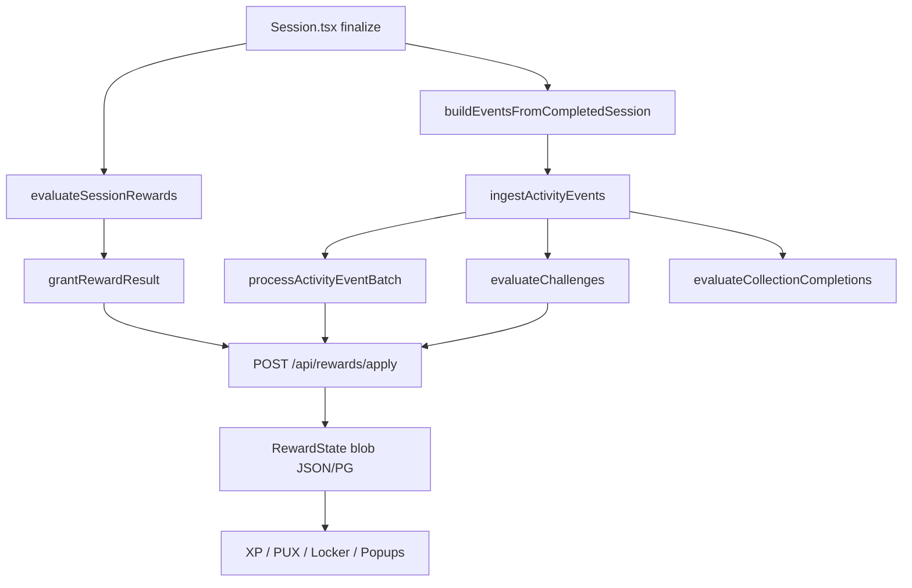

# Progression-Architektur: Ist vs. Ziel

> Audit-Stand: 2026-08-25. Strategischer Zielzustand vs. Codebestand.
> Feedback Christoph eingearbeitet (verbindliche Entscheidungen). Noch keine Implementierung der Grundprogression.

## Kurzfazit

Die fachliche Zieltrennung passt. **Wir müssen die Architektur nicht neu aufrollen.**

Der zentrale technische Befund: **Es fehlen nicht primär Belohnungen — es existieren zwei teilweise parallele Belohnungssysteme** (Legacy Rewards + Tank-Progression), die denselben `RewardState` beschreiben. Eine neue Grundprogression **daneben** zu bauen würde eine dritte Schicht erzeugen — das ist verboten.

**Technische Leitlinie:**

> Alle Bereiche (Grundprogression, Curriculum, Mastery, Achievements, Challenges, Events, Shop) müssen langfristig **dieselbe Event- und Grant-Pipeline** verwenden. Kern: vorhandene `RinkActivityEvent`-Schicht. Kein Event-Sourcing-Monster, kein Komplettumbau.

**Konsolidierungsregel:**

> Keine dritte Progressionslogik. Legacy wird in die Tank-Progression überführt oder vorübergehend per Adapter angebunden.

---

## Verbindliche Entscheidungen (eingefroren)

| Punkt | Entscheidung |
|---|---|
| Identische Kombination `game_id + Drittel + drill_id` | Nur **einmal** Grund-XP und Grund-PUX |
| Anderer Drill im selben Drittel | **Zählt** (andere Lernhandlung) |
| Derselbe Drill, anderer Spiel-/Drittel-Kontext | **Zählt erneut** |
| Derselbe Drill, identischer Kontext | **Zählt nicht** erneut für Grundrewards |
| Kanonischer Key | `progression_unit_key = game_id + observation_scope(P1\|P2\|P3) + drill_id` — `session_id` allein reicht nicht |
| `FULL_GAME` | Kein regulärer neuer Session-Typ; volles Spiel = drei Sessions; Event `full_game_completed` separat |
| Historische `FULL_GAME`-Sessions | Kompatibel halten; **nicht** rückwirkend als drei Einheiten werten |
| Track 0 | Einmaliges Onboarding-Event + Bundle; **kein** wiederholbares Basis-XP/PUX |
| Level + Kapitel | **Beides:** endlose Level (Rechenebene) + Kapitel als kuratierte Reward-Abschnitte |
| Bestehende Level-Rewards (5/10/15/20) und 100 XP/Session | Nur Ist-Implementierung, **kein** festes finales Balancing |
| Progressionsgeschwindigkeit | **Phase 2** — iterativ; Messmethode/Dramaturgie stehen, **Schwellenwerte noch nicht** |
| Tunability | Kurven, Basisrewards und Meilensteine **datengetrieben anpassbar** (ohne Code-Rewrite) |
| Anti-Farm (Release) | Eindeutige Progressionseinheit + serverseitige Idempotenz + Validierung + Logging — **keine** Tageslimits/Cooldowns |
| Ledger | Jetzt: Event-Vertrag + serverseitige Dedup-Regel; Append-only-Ledger nur bei echtem Bedarf |
| Cosmetics-Zuordnung | Später; **bestehender Besitz bleibt** bei Migration erhalten |
| `period_checkin` | Technische Mapping-Schuld ja; inhaltlich nicht als „primitive Check-ins“ lesen; **jetzt nicht** umbenennen; später `mechanic_family_id` |

### Produktmodell Session

```text
P1 + Drill = Session 1
P2 + Drill = Session 2
P3 + Drill = Session 3
→ optional full_game_completed (Achievement / kleiner Bonus)
```

### Level + Kapitel (strukturell)

```text
Lifetime-Level: technisch endlos (gedeckelte Kosten — siehe Phase 2)
Kapitel immer abschließbar und versioniert; neue Kapitel werden angehängt
Kapitel 1: Level 1–10   (Platzhalter)
Kapitel 2: Level 11–25
Kapitel 3: Level 26–50
Kapitel 4: Level 51–75
Kapitel 5+: später
Core Journey + Prestige ohne Reset + versionierte Zusatzkapitel + Saison (getrennt)
```

Ist-Kurve `100 × n^1.35` ist für endloses Level **verworfen** — ersetzt durch ansteigend-dann-gedeckelt (Phase 2).

### Track 0

```text
Track 0 abgeschlossen
→ einmaliges Onboarding-Event
→ dosiertes Bundle (~Level-2-Erlebnis + Starter-Reward + kleiner PUX)
→ kein wiederholbares Basis-XP oder Basis-PUX
→ darf frühe verdiente Commons nicht überspringen
```

---

## Phase 2: Progressionsgeschwindigkeit & Tunability

> **Ausgearbeitet in:** [grundprogression-phase2.md](./grundprogression-phase2.md) (Rev. 2 — **EINGEFROREN**).  
> **Inventory (Phase 3):** [progression-inventory-phase3.md](./progression-inventory-phase3.md).  
> **Migration + Anti-Farm (Phase 4):** [progression-migration-phase4.md](./progression-migration-phase4.md).

Im Architektur-Post bereits festgelegt (Rahmen, nicht Zahlen):

- Grundeinheit: `1 Drittel = 1 Session = 1 Drill = 1 Progressionseinheit`
- Design-Persona: **4 Sessions pro Woche** (2 Spieltage × 2 Sessions)
- Vergleichstypen: locker (2/Woche), Standard (4), intensiv (8–10)
- Frühe dichte Belohnungen, langfristig langsamere Progression
- Track 0 nur einmalig; keine Belohnung fürs bloße Öffnen/Wiederholen
- **Keine harte Tagesobergrenze**

Tabellen wie „nach 2–4 Sessions erstes Common“ sind **plausible Entwürfe**, kein final balanciertes Regelwerk. Die exakte Geschwindigkeit gehört in **Phase 2** und wird **iterativ** kalibriert.

### Tunability (Architektur-Anforderung)

Progression muss **einfach nachjustierbar** sein, wenn es zu schnell oder zu langsam läuft — ohne Systemumbau.

Konkret bedeutet das für die Implementierung:

- **Zentrale Konfiguration** für XP-Kurve, Basis-XP/PUX pro valider Einheit, Kapitel-Grenzen, Meilenstein-Slots (nicht in UI/Session-Code verstreut)
- **Reward-Regeln als Daten** (`reward_rule_id`, Schwellen, Bundles) — nicht fest verdrahtet
- **Simulation** gegen Personas (locker / Standard / intensiv) vor größeren Releases
- Bestehende Werte (100 XP/Session, Level 5/10/15/20) sind Startpunkte zum Tuning, keine Dogmen

Kurz: Wir bauen das **Regelwerk als Schrauben**, die Geschwindigkeit kommt in Phase 2.

---

## Anti-Farming & Release-Guardrails

Pragmatische Release-Lösung:

> **Eindeutige Progressionseinheit, serverseitige Idempotenz, einmaliger Track-0-Reward, strukturelle Validierung, auffällige Nutzung protokollieren.**

### Low-Hanging-Fruits (verbindlich)

**1. Eindeutiger Schlüssel pro Progressionseinheit**

```text
user_id + game_id + observation_scope + drill_id
```

→ Basisreward nur einmal. Neue `session_id` darf das nicht umgehen. Anderer Drill im gleichen Drittel zählt.

**2. Idempotenz pro Reward-Regel**

```text
user_id + progression_unit_key + reward_rule_id
```

→ Kein doppeltes XP/PUX/Achievement für denselben Abschluss.

**3. Track 0 einmalig pro Account**

```text
track0_onboarding_completed:{user_id}
```

→ Kein erneuter Onboarding-Reward, kein Basis-XP/PUX; Neuanlegen der Lesson setzt nicht zurück.

**4. Nur valide abgeschlossene Sessions**

Mindestens: gültige `game_id`, `P1|P2|P3`, gültige `drill_id`, Drill im Curriculum, Drill zum Modul/Track passend, `COMPLETED`, erforderliche Eingaben technisch abgegeben. Leere Antworten / Durchklicken = kein Abschluss.

**5. Keine Rewards beim erneuten Öffnen/Bearbeiten**

Belohnung hängt an der **fachlichen Progressionseinheit**, nicht am UI-Vorgang (Reopen, Edit, Reload, Delete+Recreate).

**6. `full_game_completed` nur serverseitig ableiten**

```text
P1 + P2 + P3 abgeschlossen (gleiches Spiel) → full_game_completed
```

Client darf kein `FULL_GAME`-Event direkt schicken.

**7. Server entscheidet über Grant-Höhe (Release-Pflicht)**

Client meldet `session_completed` (bzw. Events). Server wendet erlaubte Regeln an — Client darf keine beliebigen XP/PUX-Deltas vorgeben. *(Ist-Zustand: Client-Grants — größte Schwachstelle laut Audit.)*

**8. Auffälligkeiten protokollieren, nicht sofort bestrafen**

Logging für: viele Abschlüsse kurz hintereinander, wiederholte identische Keys, unrealistisch kurze Sessions, fehlgeschlagene Grant-Versuche, unbekannte Event-Typen. **Keine** harten Limits für ehrliche Intensivnutzer.

### Explizit nicht (v1)

- Keine tägliche XP-Obergrenze
- Keine künstlichen Cooldowns
- Keine Pflicht-Mindestdauer (z. B. 10 Min.)
- Keine Captchas
- Keine Bestrafung für 8–10 ehrliche Sessions/Woche
- Keine aufwendige KI-Betrugserkennung

Zeit ist kein Qualitätsnachweis. Strukturelle Idempotenz statt Anti-Cheat-Theater.

---

## Arbeitsreihenfolge (korrigiert)

1. Backbone und Entscheidungen einfrieren *(dieses Dokument)*.
2. **Phase 2 — Grundprogression fachlich:** Levelkurve, Kapitel, Basisreward, **Progressionsgeschwindigkeit** (iterativ), Reward-Slots, Tunability-Anforderungen — ohne Code.
3. Bestehende Legacy- und Tank-Rewards **vollständig inventarisieren**.
4. Ziel-Pipeline, **Migration** und **Anti-Farm-Guardrails** definieren (Besitz erhalten, Server-Eval für Grundrewards).
5. Erst dann Grundprogression **implementieren** (datengetriebene Regeln, Dedup-Keys).
6. Geschwindigkeit **tunen** anhand Persona-Simulation + echter Nutzung.
7. Danach Mastery, Achievement-Serien, zeitliche Systeme.
8. Cosmetics den Slots zuordnen (weiterhin später).

---

## 1. Kompakte Ist-Architektur



Zwei Evaluationsebenen, ein State — das ist der größte Handlungsbedarf:

| Schicht | Ort | Aufgabe |
|---------|-----|---------|
| Legacy Rewards | [`frontend/src/features/rewards/`](../../frontend/src/features/rewards/) | Session-PUX, Medal-Achievements, Drill-Tiers bronze→mastery, Toast-Queue |
| Tank Progression | [`frontend/src/features/progression/`](../../frontend/src/features/progression/) | XP/Level, Activity-Events, Tank-Achievements, Cosmetics/Shop/Collections, Challenges, Track-/Drill-Milestones |
| Persistenz | [`backend/main.py`](../../backend/main.py) `/api/rewards/state` + `/api/rewards/apply`; [`json_reward.py`](../../backend/repositories/json_reward.py) / [`pg_reward.py`](../../backend/repositories/pg_reward.py) | Client berechnet Grants; Server merged unter Lock mit Idempotenz |

Dokumentierter Content-Pfad: [`docs/rewards-content.md`](../rewards-content.md).

Risiken des Doppelpfads: doppelte/widersprüchliche Belohnungen, zwei Achievement-Definitionen, zwei Mastery-Systeme, schwieriges Balancing, unklare Zuständigkeiten, hässliche Migrationen.

---

## 2. Bestandteile vs. Ziel — Einordnung

### Bereits passend vorhanden

- **XP / Account-Level:** [`levelSystem.ts`](../../frontend/src/features/progression/levelSystem.ts), [`xpRules.ts`](../../frontend/src/features/progression/xpRules.ts), `RewardState.xp`.
- **PUX als Soft Currency:** `RewardState.currency.PUX`, Shop via [`shopEngine.ts`](../../frontend/src/features/progression/shop/shopEngine.ts).
- **Drei Belohnungsarten getrennt:** XP / PUX / Cosmetics.
- **Activity-Event-Taxonomie:** [`types.ts`](../../frontend/src/features/progression/types.ts) `RinkActivityEvent` + Builder.
- **Definition-driven Challenges:** Daily/Weekly/Matchday.
- **Cosmetics / Locker / Shop / Collections.**
- **Track-Abschluss als Event:** `track_completed`.
- **Dummy-Schutz** und **Bootstrap/Rebuild.**

### Vorhanden, aber anpassen / entkoppeln (Konsolidierung)

- Dual Achievement-Systeme → eine Definitionswelt.
- Dual Mastery → eine Linienwelt.
- Zwei Apply-Pfade pro Session → eine Grant-Pipeline.
- Achievements flat → Serien mit `series_id`.
- Mechanic-Heuristiken → explizite `mechanic_family_id` (später).
- Seltenheit nur am Item → getrennte Achsen Quelle/Prestige/Verfügbarkeit/Intensität (später).
- Level-Rewards ohne Kapitelrahmen → Level + Kapitel.
- Client-autoritative Grants → mittelfristig Dedup/Eval serverseitig für Grundrewards.

### Fehlt / als Nächstes zu spezifizieren

- `progression_unit_key` und serverseitige Dedup für Grund-XP/PUX (+ `reward_rule_id`-Idempotenz).
- Event `full_game_completed` (serverseitig aus drei Perioden-Sessions).
- Kapitelmodell + **tunable** XP-Kurve / Meilenstein-Konfiguration (Phase 2).
- Track-0-Onboarding-Bundle (einmalig, Key `track0_onboarding_completed`).
- Strukturelle Session-Validierung (Abschluss nur bei plausiblen Eingaben).
- Server-seitige Grant-Evaluierung für Grundrewards (Release-Pflicht).
- Observability/Logging für auffällige Nutzung.
- Formale Progressionslinien / Mechanikfamilien (nach Grundprogression).
- Append-only-Ledger nur bei Bedarf.

### `period_checkin` — Korrektur

Technisch hängt der String noch an Renderern, Sidequests und alten Ableitungen (**Mapping-Schuld: ja**). Inhaltlich sind viele dieser Drills ausgearbeitete Mechaniken — **nicht** als „Curriculum = simple Check-ins“ lesen. **Jetzt nicht umbenennen.** Für Mastery später `mechanic_family_id`, nicht dauerhaft aus `drill_type` raten.

---

## 3. Datenfluss: Session → Fortschritt → Rewards

**Was als abgeschlossen gilt:** `session.state === 'COMPLETED'` und progression-eligible (kein Dummy). Abschluss in [`Session.tsx`](../../frontend/src/pages/Session.tsx).

**Heute:**

1. Legacy: `evaluateSessionRewards` → PUX/Medals/Tiers → `grantRewardResult`.
2. Events: `buildEventsFromCompletedSession` → `session_completed:{sessionId}` …
3. `ingestActivityEvents` → XP/Achievements/Cosmetics/Challenges → weiterer Apply.

**Ziel:** Ein Pfad Event → Evaluation → Grant; Idempotenz über `progression_unit_key` für Grundrewards, nicht nur über `session_id`.

**Ledger-ähnlich heute:** Idempotenz-Keys + Event-Typen. **Noch nicht Ledger:** mutable Balance, truncated Log, Client-Grants.

---

## 4. Fortschritts-Ledger / Pipeline

1. Eine Evaluationspipeline; Legacy als Adapter oder Migration in Tank.
2. Event-Payload: mindestens `gameId`, `observation_scope`, `drillId`, `trackId`, später `mechanic_family_id`.
3. Dedup-Regel für Grund-XP/PUX serverseitig (oder zumindest enforce-fähig) am `progression_unit_key`.
4. Kein Event-Sourcing-Rewrite. Append-only nur wenn Soft-Idempotenz nicht mehr reicht.

---

## 5. Gleichung und Session-Modell (verbindlich)

| Aspekt | Entscheidung |
|--------|----------------|
| Reguläre Einheit | Ein Drittel (`P1`/`P2`/`P3`) + ein Drill + konkretes Spiel |
| Key | `game_id + observation_scope + drill_id` |
| `FULL_GAME` | Abschaffen für neue Sessions; historisch kompatibel, nicht als 3× zurückrechnen |
| Track 0 | Sonderfall Onboarding (`LESSON`), kein Farm |
| Curriculum-Fortschritt | weiter über Drill-/Modul-/Track-Abschluss (separater Bereich) |

Ist-Abweichungen im Code (zur Migration): `FULL_GAME` noch erlaubt; Create ohne Uniqueness auf dem Key; Base-XP `always` pro `sessionId`.

---

## 6. curriculum.json — Metadaten

- Tracks A–E (+ M); Track 0 Foundation.
- `drill_type` / `config.mechanic` vorhanden; kein `renderer`-Feld; Routing separat.
- Für Mastery später: stabile `mechanic_family_id` im Content, Heuristik in `deriveMechanicIdsFromSession` ablösen.

---

## 7. Relevante Dateien

- Session: [`Session.tsx`](../../frontend/src/pages/Session.tsx), [`SessionSetup.tsx`](../../frontend/src/pages/SessionSetup.tsx), `POST /api/sessions`
- Legacy: [`evaluateSessionRewards.ts`](../../frontend/src/features/rewards/logic/evaluateSessionRewards.ts), [`RewardContext.tsx`](../../frontend/src/features/rewards/state/RewardContext.tsx)
- Progression: [`progressionEngine.ts`](../../frontend/src/features/progression/progressionEngine.ts), [`xpRules.ts`](../../frontend/src/features/progression/xpRules.ts), [`levelSystem.ts`](../../frontend/src/features/progression/levelSystem.ts)
- Events: [`activityEvents.ts`](../../frontend/src/features/progression/activityEvents.ts), [`buildActivityFromSources.ts`](../../frontend/src/features/progression/buildActivityFromSources.ts)
- Persistenz: Reward-Apply in [`backend/main.py`](../../backend/main.py)
- Content-Ops: [`docs/rewards-content.md`](../rewards-content.md)

---

## 8. Migrationsprinzip

- Bestehende Unlocks/Cosmetics/PUX-Besitz **erhalten**, auch wenn der Bezugsweg später wechselt.
- Inventory Legacy + Tank vor Code-Umbau.
- Historische `FULL_GAME`-Sessions nicht zu drei Einheiten aufblasen.
- Cosmetics-Zuordnung (Phase Cosmetics) respektiert bestehende Origins.

---

## Leitlinie für die nächste Arbeit

1. Dieses Dokument = eingefrorener Backbone + Guardrails.
2. **Phase 2 (fachlich):** Grundprogression inkl. **Progressionsgeschwindigkeit** — iterativ, tunable by design, Reward-Slots, noch ohne Code.
3. Inventory + Migrationsplan + Anti-Farm-Spezifikation.
4. **Implementierung:** eine Pipeline, Dedup-Keys, serverseitige Grundrewards, datengetriebene Regeln — dann **tunen**, nicht neu bauen.

Gesamturteil: Das gewünschte System ist in Ansätzen vorhanden, historisch doppelt gewachsen — **konsolidieren, bevor systematisch erweitern**. Geschwindigkeit kommt in Phase 2; Architektur muss sie **einfach anpassbar** machen.
