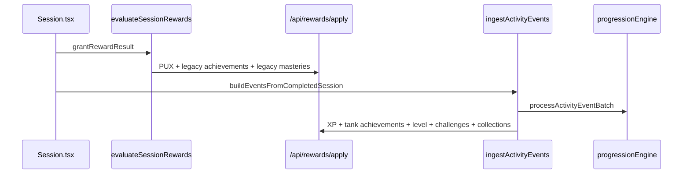

# Progression Inventory — Phase 3

> Stand: 2026-08-25. Vollständige Bestandsaufnahme Legacy Rewards + Tank Progression.  
> **Keine Implementierung.** Basis für Phase 4 (Migration + Anti-Farm-Spec).  
> Verweist auf [progression-architecture-audit.md](./progression-architecture-audit.md) (Phase 1) und [grundprogression-phase2.md](./grundprogression-phase2.md) (Phase 2, eingefroren).

## Kurzfazit

| Befund | Detail |
|---|---|
| **Ein State** | Beide Stacks schreiben in denselben `RewardState` (JSON, serverseitig via `/api/rewards/apply`) |
| **Zwei Evaluatoren** | Legacy: `evaluateSessionRewards` · Tank: `ingestActivityEvents` → `progressionEngine` |
| **Doppelte Session-Belohnung** | Legacy PUX (~10+ Boni) **und** Tank XP (100+) pro Session — **kein** gemeinsamer `progression_unit_key` |
| **Doppelte Achievements** | 15 Legacy (nur PUX, Medals) + 45 Tank (XP/PUX/Cosmetics) — teils semantisch überlappend |
| **Dreifache Mastery** | Legacy Drill-Tiers · Tank Drill-Runs · Tank Track-Mastery |
| **Cosmetics** | Nur Tank-Katalog (107 Stück); Legacy hat keine eigenen Cosmetics |
| **Dedup heute** | `processedSessions` (Legacy) + `processedEvents` (Tank, event-id) — **nicht** `game_id+scope+drill_id` |
| **Server-Trust** | Server merged Client-Payload — **keine** serverseitige Reward-Regel-Engine |
| **Dormante Legacy-Boni** | Performance/Perfect-Bonus definiert, aber `Session.tsx` übergibt `performance: null` |
| **Legacy-Mastery-Lücke** | Silver/Gold/Mastery Accuracy-Gates inaktiv — `deriveRewardFacts` setzt keine `averageAccuracy` |

---

## Shared State: `RewardState`

Datei: [`frontend/src/features/rewards/types.ts`](../../frontend/src/features/rewards/types.ts)

| Feld | Stack | Inhalt |
|---|---|---|
| `currency.PUX` | Beide | PUX-Saldo |
| `xp` | Tank | Lifetime-XP |
| `processedSessions` | Legacy | Session-id → PUX-Grant (Legacy-Pfad) |
| `processedEvents` | Tank | Event-id → XP/PUX-Grant |
| `unlockedAchievements` | Beide | **Gemeinsame Map** — Legacy-IDs und Tank-IDs vermischt |
| `unlockedMasteries` | Legacy | `drillId:tier` Bronze/Silver/Gold/Mastery |
| `unlockedCosmetics` | Tank | CosmeticUnlock inkl. Shop-Käufe |
| `activityLog` | Tank | Append-only Event-Log |
| `unlockHistory` | Tank | UI-Historie |
| `challengeProgress` / `challengeRotation` | Tank | Challenges |
| `completedCollections` | Tank | Collection-Abschlüsse |
| `masteryMilestoneUnlocks` | Tank | Track/Drill-Mastery-Grants |
| `puxTransactions` | Tank | Shop-Ledger |
| `venueVisits` | Tank | Venue-Presence |

Persistenz: `GET/POST /api/rewards/state|apply` — [`backend/main.py`](../../backend/main.py) (`_compute_reward_apply`).

Idempotenz serverseitig:

- `event_id` in `processedEvents` → kein erneuter Tank-Grant
- `session_id` in `processedSessions` → kein erneuter Legacy-Grant (wenn kein `event_id`)
- **Kein** Dedup über `progression_unit_key` (Phase-2-Ziel)

**Server-Modell:** Client evaluiert alle Regeln; `POST /api/rewards/apply` merged unter Lock (`RewardRepository.apply_reward_delta`). Server prüft Idempotenz und Negativsaldo, **rechnet Grants nicht neu**.

Weitere Dedup-Mechanismen (Tank):

| Mechanismus | Key | Regel |
|---|---|---|
| Achievement | `achievementId` | Einmal pro ID |
| Cosmetic | `cosmeticId` | Skip wenn owned |
| Track-XP | `trackId` in activity log | 500 XP nur erstes `track_completed` |
| Challenge | `challenge_completed:{instanceKey}` | Pro Rotations-Instanz |
| Collection | `collection_completed:{collectionId}` | Einmal pro Set |
| Bootstrap | `bootstrap:v1` | Einmal (außer `forceRebuild`) |
| Shop | `pux_shop_purchase:{listingId}` | Bei Dev-Rebuild erhalten |

---

## Runtime-Flow (Session abschließen)

Quelle: [`frontend/src/pages/Session.tsx`](../../frontend/src/pages/Session.tsx) (`finalizeSessionRewards`).

---

## Stack A — Legacy Rewards

Pfad: [`frontend/src/features/rewards/`](../../frontend/src/features/rewards/)

### A1. Basis-PUX pro Session

Datei: [`evaluateBaseRewards.ts`](../../frontend/src/features/rewards/logic/evaluateBaseRewards.ts)

| Grant | Trigger | PUX | Ist-Status | Dedup |
|---|---|---:|---|---|
| Completion | Session eligible + completed | 10 | **aktiv** | `processedSessions[sessionId]` |
| Streak-Bonus | ≥3 aktive Tage | +5 | **aktiv** | pro Session |
| Performance-Bonus | Accuracy ≥85% | +5 | **dormant** — `Session.tsx` setzt `performance: null` | — |
| Perfect-Bonus | `performance.perfect` | +20 | **dormant** — kein Caller | — |

**Praktisches Maximum heute:** 15 PUX/Session (10 + Streak). Theoretisch 40 wenn Performance angebunden würde.

**Kein XP.** Kein Bezug zu `game_id` / Drittel. Pro Session, nicht pro Progression Unit.

### A2. Legacy Achievements (15)

Datei: [`data/achievements.ts`](../../frontend/src/features/rewards/data/achievements.ts)  
Evaluator: [`evaluateAchievements.ts`](../../frontend/src/features/rewards/logic/evaluateAchievements.ts)

| ID | Bedingung (Kurz) | PUX | Tier |
|---|---|---:|---|
| `first-drill-complete` | 1 Drill | 10 | bronze |
| `ten-drills-complete` | 10 Drills | 25 | silver |
| `fifty-drills-complete` | 50 Drills | 50 | gold |
| `three-completed-in-a-row` | 3 Session-Streak | 20 | silver |
| `seven-active-days` | 7 aktive Tage | 35 | gold |
| `five-distinct-drills` | 5 versch. Drills | 20 | silver |
| `ten-distinct-drills` | 10 versch. Drills | 35 | gold |
| `five-drills-one-session` | 5 Drills/Session | 25 | silver |
| `long-notes` | Notiz ≥500 Zeichen | 30 | gold |
| `early-bird` | 4–6 Uhr | 10 | bronze |
| `night-owl` | 0–3 Uhr | 15 | silver |
| `prime-time-scout` | 19–22 Uhr | 15 | silver |
| `mobile-scout` | Mobile | 10 | bronze |
| `desktop-room` | Desktop | 10 | bronze |
| `ten-drills-one-session` | 10 Drills/Session | 50 | mastery |

Rewards: **nur PUX** + Popup-Tier (Medal-Look). Keine Cosmetics. **Gesamt-PUX aller 15:** 360.

**Unbenutzt:** Condition-Typ `session_duration_max_seconds` in Types/Evaluator, aber kein Achievement nutzt ihn.

### A3. Legacy Drill-Mastery (4 Tiers)

Datei: [`data/mastery.ts`](../../frontend/src/features/rewards/data/mastery.ts), [`evaluateMastery.ts`](../../frontend/src/features/rewards/logic/evaluateMastery.ts)

| Tier | min Runs | min Accuracy | PUX | Key |
|---|---:|---|---:|---|
| bronze | 1 | — | 10 | `{drillId}:bronze` |
| silver | 3 | 0.70 | 15 | `{drillId}:silver` |
| gold | 5 | 0.85 | 25 | `{drillId}:gold` |
| mastery | 8 | 0.95 | 40 | `{drillId}:mastery` |

Zählt **Runs pro drill_id** über alle Sessions (ohne Kontext-Dedup).

**Implementierungs-Lücke:** `deriveRewardFacts` inkrementiert nur `runs`, nie `averageAccuracy`. `meetsThreshold()` behandelt fehlende Accuracy als bestanden → **Silver/Gold/Mastery hängen faktisch nur an Run-Count**, Accuracy-Gates sind inaktiv. Max **90 PUX/Drill** (alle 4 Tiers).

### A4. UI / Queue

- [`RewardContext.tsx`](../../frontend/src/features/rewards/state/RewardContext.tsx) — Popup-Queue, `grantRewardResult`
- [`RewardPopup.tsx`](../../frontend/src/features/rewards/ui/RewardPopup.tsx) — Bronze/Silver/Gold/Mastery Visuals

---

## Stack B — Tank Progression

Pfad: [`frontend/src/features/progression/`](../../frontend/src/features/progression/)

### B1. XP-Regeln

Datei: [`xpRules.ts`](../../frontend/src/features/progression/xpRules.ts)  
Engine: [`progressionEngine.ts`](../../frontend/src/features/progression/progressionEngine.ts)

| Rule-Key | Event | XP | Policy | Anmerkung |
|---|---|---:|---|---|
| `session_completed` | `session_completed` | 100 | always | **Pro Event**, nicht pro Unit-Key |
| `first_session_of_drill` | `session_completed` + flag | +25 | first_only | Erste Session je **drill_id** (global) |
| `track_completed` | `track_completed` | 500 | first_only | Pro trackId |
| `scene_created` | `scene_created` | 20 | always | |
| `scene_rated_five` | `scene_rated` rating=5 | 10 | always | |
| `sidequest_completed` | `sidequest_completed` | 25 | always | |

Session-Events: [`buildActivityFromSources.ts`](../../frontend/src/features/progression/buildActivityFromSources.ts) → `session_completed` mit `drillId`, `gameId`, Tags, `isFirstSessionOfDrill`.

**Kein base_pux** in XP_RULES — PUX aus Session kommt primär aus Legacy.

### B2. Level-Meilensteine

Datei: [`levelSystem.ts`](../../frontend/src/features/progression/levelSystem.ts)

| Level | Rewards | Cosmetic-ID |
|---:|---|---|
| 5 | 50 PUX | `title_level_5_observer` |
| 10 | 100 PUX | `banner_level_10` |
| 15 | 150 PUX | `title_level_15_analyst` |
| 20 | 200 PUX | `emblem_level_20` |

Kurve Ist: `100 × n^1.35` — **Phase 2: verworfen**, ersetzt durch gedeckelte Tabelle.

### B3. Tank Achievements (45)

| Katalog | Anzahl | Datei |
|---|---:|---|
| Phase 1 | 22 | [`achievementCatalog.ts`](../../frontend/src/features/progression/achievements/achievementCatalog.ts) |
| Phase 2 | 23 | [`phase2Achievements.ts`](../../frontend/src/features/progression/achievements/phase2Achievements.ts) |

Engine: [`achievementEngine.ts`](../../frontend/src/features/progression/achievements/achievementEngine.ts) — event-basiert auf `activityLog`.

Rewards typisch: XP + PUX, oft + Cosmetic. Beispiele:

- `first_shift` (1 Session) → 50 XP, 25 PUX, `title_first_shift`
- `getting_warm` (10 Sessions) → 150 XP, 50 PUX
- `same_drill_five` (5× gleicher Drill) → 150 XP, 100 PUX, Cosmetic

### B4. Mastery (Tank) — zwei Systeme

**Track-Mastery** (4 Tracks): [`masteryCatalog.ts`](../../frontend/src/features/progression/mastery/masteryCatalog.ts) — C1, C2, D3, …  
Meilensteine pro Track (1/3/5 Runs **je Drill im Track**): XP, PUX, Coins, Titles.

**Drill-Mastery** (generisch): `DRILL_MASTERY_MILESTONES` — 1/3/5/10 Runs pro `drill_id`:

| Threshold | Label | Rewards |
|---:|---|---|
| 1 | Familiar | 25 XP |
| 3 | Trained | 40 PUX |
| 5 | Mastered | 100 XP + 60 PUX |
| 10 | Obsessed | 200 XP + 100 PUX + `title_drill_obsessed` |

Engine: [`masteryEngine.ts`](../../frontend/src/features/progression/mastery/masteryEngine.ts) — **zählt Runs ohne game/scope-Dedup**.

### B5. Cosmetics (107)

Katalog: [`cosmeticCatalog.ts`](../../frontend/src/features/progression/cosmetics/cosmeticCatalog.ts) (+ Phase2, Starter-Presets, PoC Stick/Puck)

Für die vollständige ID-/Source-/Asset-Tabelle (inkl. Dual-Path, Orphans und Grant-Lücken) siehe das Deep-Inventory [`cosmetic-inventory-phase3.md`](./cosmetic-inventory-phase3.md). Dieser Abschnitt bleibt die Kurzfassung der Herkunftsverteilung und Shop-Zahlen.

| Origin | Anzahl | Beispiele |
|---|---:|---|
| starter | 29 | Avatare, Banner, Embleme, Titles |
| pux_shop | 34 | Shop-evergreen |
| achievement | 22 | Achievement-Exclusives |
| track_mastery | 7 | Mastery Coins |
| level | 4 | Level 5/10/15/20 |
| collection | 5 | Collection-Completion |
| challenge | 5 | Challenge-Rewards |
| secret | 1 | Hidden |

Shop: 30 Listings — [`shopCatalog.ts`](../../frontend/src/features/progression/shop/shopCatalog.ts) (100–2600 PUX).

### B6. Collections (8)

Datei: [`collectionCatalog.ts`](../../frontend/src/features/progression/collections/collectionCatalog.ts)

| ID | Completion (Kurz) |
|---|---|
| `the_slot` | 200 XP, 100 PUX, `banner_property_of_the_slot` |
| `blue_line_department` | 250 XP, 120 PUX, `banner_blue_line_wizard` |
| `rink_rat_starter` | 150 XP, 80 PUX, `frame_rink_rat` |
| `neutral_zone_goblins` | 300 XP, 150 PUX, Banner |
| `night_circuit` | 500 XP, 400 PUX, Tagline |
| `matchday_moments` | 50 PUX |
| `arena_passport` | 80 PUX |
| `wasteland` *(secret)* | 40 PUX |

Dedup: `collection_completed:{collectionId}`.

### B7. Challenges (12)

Registry: [`content/registry.ts`](../../frontend/src/content/registry.ts)

- 9 MVP (`mvpChallenges.ts`) — 2 daily, 2 weekly, 5 matchday/once; `challenge_collection_survive_the_shift` **disabled**
- 3 Matchday-Prototyp AEV–STR (`matchdays/del_2025_2026_aev_str_2025-12-21.ts`)

Pools: `pool_daily_mvp` (2 aktiv/Tag), `pool_weekly_mvp` (2 aktiv/Woche) — [`pools.ts`](../../frontend/src/content/challenges/pools.ts).

### B8. Bootstrap / Retroaktiv

[`bootstrap.ts`](../../frontend/src/features/progression/bootstrap.ts) — Event `bootstrap:v1`; einmalig alle eligible Sessions/Scenes → Events → XP/Achievements; seeded Starter-Cosmetics (29). Skip wenn `processedEvents['bootstrap:v1']` gesetzt (außer Dev `forceRebuild`).

### B9. Activity-Events (Tank)

Pro Session typisch aus [`buildEventsFromCompletedSession`](../../frontend/src/features/progression/buildActivityFromSources.ts):

- `session_completed:{sessionId}`
- `observation_created:{sessionId|occurredAt}`
- optional `game_observation_completed:{sessionId}:{gameId}`
- N× `sidequest_completed:{sidequestId}`

Dummy-Sessions: `isDummy: true` → Events werden markiert, **keine** Grants (Client + Server).

---

## Überlappungs-Matrix

| Fähigkeit | Legacy | Tank | Konflikt |
|---|---|---|---|
| Session-Basis PUX | 10+ Boni | — (via Legacy) | Legacy-only, aber parallel zu Tank-XP |
| Session-Basis XP | — | 100/event | Kein PUX in Tank-Basis |
| First Drill Bonus | — | +25 XP (global drill_id) | Phase 2: Bonus pro drill_id ok |
| Achievement „10 Drills“ | `ten-drills-complete` (PUX) | `getting_warm` (XP+PUX) | **Doppelte Semantik** |
| Achievement „First Session“ | `first-drill-complete` | `first_shift` (+ Cosmetic) | **Doppelte Semantik** |
| Drill-Wiederholung | Legacy Mastery (accuracy) | Drill-Mastery (runs) + Achievements | **Dreifach**, kein Kontext-Dedup |
| Track-Abschluss | — | XP 500 + Track-Mastery | ok, aber getrennt von Unit-XP |
| Level-Cosmetics | — | Level 5/10/15/20 | **Zu spät** für Phase-2-Slots (2/4/8–12 Einheiten) |
| Medals/Popups | Bronze–Mastery Tiers | Tank nutzt teils gleiche Tiers in UI | Visuell verwandt, andere Trigger |

---

## Idempotenz: Ist vs. Phase 2

| Mechanismus | Ist | Phase 2 Ziel |
|---|---|---|
| Legacy Session | `processedSessions[sessionId]` | Ersetzen durch `progression_unit_key` |
| Tank Event | `processedEvents[eventId]` | Behalten + Grant-Rule-Idempotenz |
| Unit-Key | **fehlt** | `user + game_id + P1\|P2\|P3 + drill_id` |
| XP + PUX gleicher Key | **getrennte Pfade** | Ein Basispaket, shared Dedup |
| Track 0 | Bootstrap-Event | Einmalig, dosiert (~100 XP) |
| Shop | `pux_shop_purchase:*` preserved on rebuild | Behalten |

---

## Vorläufige Migrations-Zuordnung (Richtung Phase 4)

| Legacy / Ist | Ziel-Pipeline | Aktion |
|---|---|---|
| `evaluateBaseRewards` PUX | `unit_rewards.base_pux` | In Event-Pipeline, Unit-Dedup |
| `session_completed` XP | `unit_rewards.base_xp` | Pro Unit-Key, nicht pro session_id |
| Legacy 15 Achievements | Tank Achievement-Katalog | Merge/Deduplizieren; PUX-only → migrieren oder deprecaten |
| Legacy Drill-Mastery | Tank Drill-Mastery **oder** deprecaten | Accuracy-Tiers vs. Run-Tiers klären; **kein** Grant bei gleichem Kontext (Phase 2) |
| Tank Drill-Mastery (runs) | Überarbeiten | Runs nur across contexts, nicht same unit |
| Level 5/10/15/20 Cosmetics | Early Slots + Kapitel | Level-5-first-Cosmetic → Slot bei 2 Einheiten |
| `first_session_of_drill` XP | `first_drill_id_bonus_xp` | Behalten, Definition drill_id ✓ |
| Challenges / Collections / Shop | Eigene Grants | Parallel, kein Basispaket |
| Starter Cosmetics (29) | Track 0 + Starter | Track-0-Geschenk vs. freie Starter trennen |
| Bootstrap retroactive | Einmalig / Dev | Nicht als Farm-Quelle |

**Besitz-Regel (eingefroren):** Bestehende `unlockedCosmetics`, `unlockedAchievements`, PUX, XP bleiben bei Migration erhalten.

---

## Lücken vs. eingefrorene Phase 2

| Phase-2-Anforderung | Ist-Stand |
|---|---|
| Frühes Common bei 2 Einheiten | Erstes earnable Cosmetic oft `first_shift` (1 Session) oder Level 5 — **Slot-Plan fehlt im Code** |
| Gedeckelte Levelkurve | Noch `n^1.35` hardcoded |
| Track 0 ~Level 2 | Bootstrap seeded starters + retro XP — **nicht dosiert** |
| Unit-Key Dedup | Nicht implementiert |
| First drill = drill_id | Tank ja; Legacy N/A |
| Mastery ≠ same context | **Gegenteil:** Run-Counts ohne Kontext |
| Zwei Simulationsläufe | Nicht vorhanden |
| Zentrale Config | Verstreut in 10+ Dateien |
| Server-Eval | Client-trust — Phase 4 muss Server-Eval für Release definieren |
| Performance/Perfect-Boni | Definiert, nicht verdrahtet |
| Legacy-Mastery-Accuracy | Definiert, faktisch Run-only |

---

## Zählübersicht

| Kategorie | Legacy | Tank | Gesamt (unique) |
|---|---:|---:|---|
| Achievements | 15 | 45 | ~60 (IDs unique, Semantik überlappt) |
| Session-Basis Grants | 1–2 PUX/Session (max 15) | 100–125 XP/Session | Beide aktiv |
| Drill-Mastery Systeme | 1 (4 Tiers) | 2 (Drill + Track) | 3 |
| Cosmetics | 0 | 107 | 107 |
| Level Milestones | 0 | 4 | 4 |
| Collections | 0 | 8 | 8 |
| Shop Listings | 0 | 30 | 30 |
| Challenges | 0 | 12 | 12 |
| XP Rules | 0 | 6 | 6 |

---

## Datei-Index (Grant-Quellen)

| Bereich | Primäre Dateien |
|---|---|
| Legacy Session | `rewards/logic/evaluateSessionRewards.ts`, `evaluateBaseRewards.ts` |
| Legacy Achievements | `rewards/data/achievements.ts` |
| Legacy Mastery | `rewards/data/mastery.ts`, `evaluateMastery.ts` |
| Tank XP/Level | `progression/xpRules.ts`, `levelSystem.ts`, `progressionEngine.ts` |
| Tank Events | `progression/buildActivityFromSources.ts`, `activityEvents.ts` |
| Tank Achievements | `progression/achievements/achievementCatalog.ts`, `phase2Achievements.ts` |
| Tank Mastery | `progression/mastery/masteryCatalog.ts`, `masteryEngine.ts` |
| Cosmetics | `progression/cosmetics/cosmeticCatalog.ts`, `phase2Cosmetics.ts` |
| Shop | `progression/shop/shopCatalog.ts`, `shopEngine.ts` |
| Challenges | `content/challenges/mvpChallenges.ts`, `progression/challenges/*` |
| Orchestration | `rewards/state/RewardContext.tsx`, `pages/Session.tsx` |
| Server | `backend/main.py` (`/api/rewards/*`) |

---

## Nächste Schritte

| Phase | Inhalt | Status |
|---|---|---|
| 1 | Architektur-Freeze | ✓ |
| 2 | Grundprogression fachlich | ✓ eingefroren |
| **3** | **Inventory** | [progression-inventory-phase3.md](./progression-inventory-phase3.md) |
| **4** | **Migration + Anti-Farm Spec** | [progression-migration-phase4.md](./progression-migration-phase4.md) |
| 5 | Implement + Tune | Offen — explizite Freigabe |
| 6–7 | Mastery / Cosmetics-Zuordnung | Offen |

**Phase 4 Spec:** Legacy-Disposition, Grant-Pipeline, Dedup-Keys, Server-Eval, Veteranen-Besitz — siehe [progression-migration-phase4.md](./progression-migration-phase4.md).
