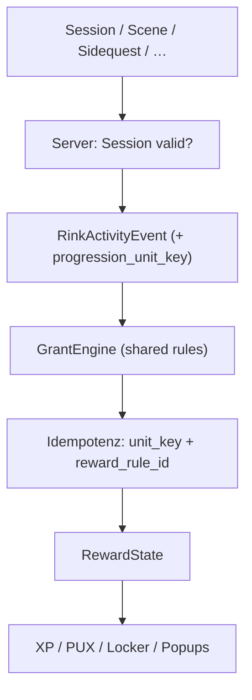

# Migration + Anti-Farm — Phase 4 (Spec)

> Stand: 2026-08-25. Technische Spezifikation für Konsolidierung Legacy → Tank und Release-Guardrails.  
> **Entscheidungen eingefroren (Christoph).** Basis für Phase 5 (Code).  
> Verweist auf [progression-architecture-audit.md](./progression-architecture-audit.md), [grundprogression-phase2.md](./grundprogression-phase2.md), [progression-inventory-phase3.md](./progression-inventory-phase3.md).

## Zweck

Phase 4 beantwortet:

1. **Wie** wird aus zwei Pfaden **eine** Grant-Pipeline?
2. **Welche** Legacy-Teile werden migriert, deprecatet, adaptiert?
3. **Wie** funktionieren Dedup, Validierung und Server-Eval (Anti-Farm)?
4. **Was** passiert mit bestehendem Nutzer-Besitz?

---

## Ziel-Architektur (Soll)



**Ein Evaluator.** Legacy `evaluateSessionRewards` entfällt nach Cutover.

**Client-Rolle:** Events melden, UI anzeigen — **keine** autoritativen XP/PUX-Deltas für Grundrewards.

**Server-Rolle:** Validierung, Regeln anwenden, Idempotenz, Persistenz, Logging.

---

## Kernbegriffe

### Progression Unit Key

```text
progression_unit_key = normalize(game_id) + "|" + observation_scope(P1|P2|P3) + "|" + normalize(drill_id)
```

| Regel | Detail |
|---|---|
| Gültige Scopes | Nur `P1`, `P2`, `P3` für **neue** Grundrewards |
| `FULL_GAME` (historisch) | Session bleibt **eine** Einheit mit Scope `FULL_GAME` — **nicht** in drei Units splitten |
| `LESSON` / Track 0 | Kein Basis-XP/PUX; separates `track0_completed`-Event |
| Dummy | Kein Key, kein Grant |
| Key ohne `game_id` | **Kein** Grundgrant (Validierung fail) |

**Speicherung:** `RewardState.processedUnits: Record<progression_unit_key, { grantedAt, sessionId, ruleIds[] }>` (neu).

### Reward Rule Idempotency Key

```text
grant_idempotency_key = user_id + "|" + progression_unit_key + "|" + reward_rule_id
```

Für nicht-unit-basierte Grants (Achievements, Level, Shop, Challenges):

```text
grant_idempotency_key = user_id + "|" + reward_rule_id + "|" + scope_ref
```

Beispiele `scope_ref`: `achievement:first_shift`, `level:10`, `challenge_completed:daily::2026-08-25`.

---

## RinkActivityEvent — Vertrag (Erweiterung)

Bestehende Builder: [`activityEvents.ts`](../../frontend/src/features/progression/activityEvents.ts).

### Pflicht-Erweiterung `session_completed`

Neue Felder auf `SessionCompletedEvent`:

| Feld | Typ | Pflicht | Zweck |
|---|---|---|---|
| `observationScope` | `P1\|P2\|P3\|FULL_GAME\|LESSON` | ja | Unit-Key-Bildung |
| `progressionUnitKey` | string | serverseitig gesetzt | Kanonischer Dedup-Key |
| `progressionEligible` | boolean | serverseitig | Nach Validierung |

**Event-ID bleibt:** `session_completed:{sessionId}` — Idempotenz pro Session-Event bleibt, **zusätzlich** Unit-Dedup für Grundrewards.

### Neues Event: `progression_unit_completed`

Optional explizites Event (Alternative: Felder nur auf `session_completed`):

```text
id: progression_unit_completed:{progressionUnitKey}
type: progression_unit_completed
sessionId, gameId, observationScope, drillId, trackId, occurredAt
```

**Empfehlung Phase 5:** Unit-Grant hängt an **`session_completed`** mit serverseitig abgeleitetem `progressionUnitKey` — kein zweites Event nötig, solange Validierung klar ist.

**Entschieden (Christoph):** `full_game_completed` wenn **P1 + P2 + P3** für dasselbe `game_id` abgeschlossen — **Drill pro Drittel darf variieren**.

### Neues Event: `full_game_completed`

```text
id: full_game_completed:{gameId}:{userId}
type: full_game_completed
gameId, occurredAt
```

**Nur serverseitig emitiert**, wenn User alle drei Units `P1+P2+P3` für dasselbe `game_id` abgeschlossen hat (oder historisch kompatible FULL_GAME-Regel — siehe unten).

### Neues Event: `track0_completed`

```text
id: track0_completed:{userId}
type: track0_completed
trackId: "T0", occurredAt
```

Einmal pro Account. Grant: dosiertes Bundle (Phase 2) — **kein** wiederholbares Basis-XP.

---

## Grant-Regeln (Ziel-Config)

Zentrale Regel-Tabelle (Phase 5: JSON/TS-Config, nicht verstreut):

| reward_rule_id | Trigger | Grants | Idempotenz |
|---|---|---|---|
| `base_unit_xp` | valide Unit | `base_xp` (Config) | unit_key |
| `base_unit_pux` | valide Unit | `base_pux` (Config) | unit_key |
| `first_drill_id_bonus_xp` | erste `drill_id` global | +25 XP (tunable) | `first_drill:{drillId}` |
| `track0_bundle` | `track0_completed` | ~100 XP + Starter + PUX | `track0_completed:{userId}` |
| `full_game_bonus` | `full_game_completed` | kleiner XP/PUX + Achievement-Hook | `full_game:{gameId}` |
| `level_milestone_{n}` | Level crossing | PUX + Cosmetic-Slot | `level:{n}` |
| `early_slot_units_2` | 2. valide Unit (count) | Cosmetic-Slot | `early_slot:2` |
| `early_slot_units_4` | 4. valide Unit | Cosmetic-Slot | `early_slot:4` |
| `achievement:{id}` | Achievement-Engine | per Definition | `achievement:{id}` |
| `challenge:{instanceKey}` | Challenge complete | per Definition | challenge key |
| … | … | … | … |

**Phase 2 Early-Slots** (2/4/8–12 Einheiten) werden **zählerbasiert** auf valid units — nicht Level-5-first.

---

## Session-Validierung (Release-Pflicht)

Server prüft vor jedem Grundgrant:

| Check | Fail → |
|---|---|
| Session existiert, User = Owner | 403 / no grant |
| `state === COMPLETED` | no grant |
| `is_dummy !== true` | no grant |
| `game_id` present & known catalog game | no grant |
| `observation_scope` in erlaubter Menge | no grant |
| `drill_id` present & in Curriculum | no grant |
| Drill passt zu Track/Modul | no grant |
| Pflicht-Checkins/Antworten technisch vorhanden | no grant |
| Reopen/Edit alter Session | kein neuer Grant (Unit-Key schon processed) |

**Kein** Mindestdauer-Check. **Kein** Tageslimit.

Validierung lebt serverseitig; Client-Eligibility (`isProgressionEligibleSession`) bleibt als Pre-Filter, ersetzt Server nicht.

---

## Anti-Farm & Logging

### Idempotenz (Release)

1. `processedUnits[progression_unit_key]` → blockiert `base_unit_xp` + `base_unit_pux`
2. `processedGrantKeys[grant_idempotency_key]` → blockiert alle Regeln
3. `track0_completed` / `full_game_completed` — eigene Keys
4. Shop: `pux_shop_purchase:{listingId}` unverändert

### Logging (keine Strafe v1)

Server loggt (structured, user_id hashed in exports):

- Grant applied / rejected (reason)
- Duplicate unit attempt (same key, new session_id)
- Rapid completions (>N sessions/10min — Schwellwert Config)
- Validation failures aggregate
- Unknown event types

**Keine** automatische Sperre v1.

### Explizit nicht v1

Tageslimits, Cooldowns, Mindestdauer, Captcha — siehe Audit.

---

## API — Zielzustand

### Option A (empfohlen): Event-Ingest Endpoint

```http
POST /api/progression/events
Body: { events: RinkActivityEvent[] }
Response: { state, grants: GrantResult[], applied: boolean }
```

Server: validate → derive keys → apply rules → persist.

### Option B (Übergang): `/api/rewards/apply` härten

Bestehendes Apply akzeptiert nur **serverseitig berechnete** Deltas; Client sendet Events statt `granted_xp`/`granted_pux`.

**Entschieden:** Zuerst Option B (apply härten), danach `POST /api/progression/events` (Option A). Schrittweise Migration, kein Big-Bang.

### Deprecated Felder (nach Cutover)

Client darf **nicht** mehr senden:

- `granted_pux` / `granted_xp` (ohne Server-Neuberechnung)
- Legacy `unlocked_masteries` (Drill-Tier)
- Legacy achievement IDs aus altem Evaluator

---

## RewardState — Schema-Evolution

| Feld | Aktion |
|---|---|
| `processedUnits` | **neu** — Unit-Dedup |
| `processedGrantKeys` | **neu** — rule-level Dedup (**eigene Map**, nicht in `processedEvents` mischen) |
| `processedSessions` | **deprecated** — nach Migration read-only |
| `unlockedMasteries` (Legacy) | **deprecated** — Besitz frozen, keine neuen Grants |
| `processedEvents` | behalten — Event-Audit |
| `activityLog` | behalten — Achievement/Challenge-Engine |
| `xp`, `currency`, `unlockedCosmetics`, … | unverändert |

**Migration:** Bestehende Werte **nie** löschen. Neue Keys parallel; Legacy-Felder frozen.

---

## Legacy → Ziel: Disposition

| Legacy (Phase 3) | Entscheidung | Begründung |
|---|---|---|
| `evaluateBaseRewards` Completion 10 PUX | → `base_unit_pux` | Unit-Dedup |
| Streak-Bonus +5 PUX | → **deprecate** | Nicht in Phase-2-Grundprogression |
| Performance/Perfect PUX | → **deprecate** (war dormant) | Nicht verdrahtet |
| 15 Legacy Achievements | → **deprecate** (keine neuen Unlock) | Tank deckt Semantik ab; IDs in `unlockedAchievements` frozen |
| Legacy Drill-Mastery (4 Tiers) | → **deprecate** | Tank Drill-Mastery + Phase-2 „kein Mastery same context“ |
| `evaluateSessionRewards` | → **entfernen** nach Cutover | Ersetzt durch Event-Ingest |
| `grantRewardResult` (Legacy-Pfad) | → **entfernen** | Ein Pfad |
| Popup-Queue (`RewardContext`) | → **behalten** | UI; federt von Server-`grants[]` |

### Tank-Anpassungen (nicht deprecate, aber ändern)

| Ist | Soll |
|---|---|
| `session_completed` → 100 XP pro Event | → 100 XP pro **validem unit_key** (Config) |
| `first_session_of_drill` global | → beibehalten (Phase 2: pro `drill_id`) |
| Drill-Mastery Run-Count ohne Kontext | → Runs zählen nur **across** contexts; gleicher unit_key zählt nicht |
| Level 5/10/15/20 Cosmetics | → bleiben + **Early-Slots** 2/4/8–12 Units |
| Level-Kurve `n^1.35` | → gedeckelte Tabelle (Phase 2) |
| Bootstrap retroactive | → einmalig; `bootstrap:v1`; kein Farm |
| Client-trust Apply | → Server-Eval |

### Achievement-Overlap (Migration)

| Legacy ID | Tank-Äquivalent | Aktion |
|---|---|---|
| `first-drill-complete` | `first_shift` | Legacy frozen; neue User nur Tank |
| `ten-drills-complete` | `getting_warm` | dito |
| `fifty-drills-complete` | `rink_rat` | dito |
| `five-distinct-drills` | Exploration-Achievements | dito |
| Device/Time Achievements | Kein direktes 1:1 | Legacy frozen; neu optional Tank-Phase-3 |

**Regel:** Wer Legacy-ID schon hat, behält PUX-Historie; kein double-grant über Tank.

---

## Mastery (Richtung — Detail-Spec Phase 6)

Phase 4 legt nur die Grenze fest:

- **Grundprogression / Unit-Key:** kein Fortschritt bei Re-Submit gleicher Unit
- **Mastery:** eigene Regeln in Phase 6; aber **explizit:** exakt gleicher Kontext (`game_id+scope+drill_id`) → **kein** Mastery-Fortschritt
- Legacy `unlockedMasteries` + Tank `masteryMilestoneUnlocks` → parallel frozen; neue Grants nur über Tank-Engine nach neuen Regeln

---

## `full_game_completed` — Ableitung

### Neue Sessions (P1/P2/P3 getrennt)

```text
Wenn processedUnits enthält:
  {gameId}|P1|{drillA}, {gameId}|P2|{drillB}, {gameId}|P3|{drillC}
  (Drills können differieren — Units sind period+drill)
→ Prüfe: alle drei Scopes für gameId mindestens einmal abgeschlossen
→ emit full_game_completed (once per gameId)
```

**Entschieden:** Drei Perioden desselben Spiels reichen; Drill pro Period kann variieren.

### Historische `FULL_GAME`-Sessions

- Eine abgeschlossene FULL_GAME-Session = **eine** Unit mit Key `{gameId}|FULL_GAME|{drillId}`
- **Kein** retroaktives Splitting in P1/P2/P3
- `full_game_completed` kann für alte User separat aus Historie abgeleitet werden (Bootstrap-Job), ohne neue Grants zu triggern wenn schon processed

---

## Track 0

| Ist | Soll |
|---|---|
| Bootstrap + Starter-Cosmetics + retro XP | `track0_completed` einmalig |
| LESSON scope, Track T0 | Grant: ~100 XP + Starter-Reward + kleiner PUX |
| Wiederholtes Öffnen | Kein Grant |

**Idempotenz:** `track0_completed:{userId}` in `processedGrantKeys`.

Starter-Cosmetics (29): weiterhin bei Erst-Setup seeden; **nicht** als erneute Progressionseinheiten zählen.

---

## Veteranen & Besitz

| Asset | Regel |
|---|---|
| XP / PUX | Behalten; nie reduzieren |
| `unlockedCosmetics` | Behalten; Shop-Käufe (`earnKind: purchased`) sacred |
| Legacy + Tank Achievements | Behalten; keine doppelten Neun-Unlocks |
| Legacy Masteries | Frozen Anzeige; keine neuen Tiers |
| Level | Behalten; Kurvenwechsel **grandfathering:** XP bleibt, neue Kurve gilt nur für zukünftige Level-ups (Phase 5 Detail) |
| Early-Slots | Nur für **neue** Units nach Cutover — keine Retro-Entwertung |

**Kein Reward-Regen** bei neuen Kapiteln (Phase 2): versionierte Kapitel starten bei 0.

---

## Implementierungs-Reihenfolge (Phase 5)

```text
5.1  Config-Skeleton (rules, curve table, early slots) — keine UI-Änderung
5.2  Server: progression_unit_key ableiten + processedUnits + Validierung
5.3  Server: base_unit_xp/pux Grants (ersetzt Legacy PUX + doppeltes session XP)
5.4  Client: Session.tsx → nur Events senden; Legacy eval hinter Feature-Flag off
5.5  Early-Slot Grants + Track0 + full_game_completed (server)
5.6  Achievement-Engine only Tank; Legacy achievements read-only
5.7  Deprecate Legacy mastery + evaluateSessionRewards
5.8  Gedeckelte Kurve + Kapitel-Config
5.9  Logging + DevLab Persona-Simulation
5.10 Feature-Flag entfernen / Cutover
```

**Feature-Flag:** `PROGRESSION_UNIFIED_PIPELINE` — Dev zuerst, dann Production.

---

## Akzeptanzkriterien (Phase 5 Done)

- [ ] Gleiche `game_id+scope+drill_id` + neue `session_id` → **0** Basis-XP/PUX
- [ ] Anderer Drill, gleiches Drittel → Basis-Grant **1×**
- [ ] Dummy-Session → **0** Grants serverseitig
- [ ] Client manipuliert `granted_xp` → Server ignoriert/rejected
- [ ] Track 0 zweites Mal → **0** Grants
- [ ] Bestehender Cosmetic-Besitz nach Migration unverändert
- [ ] Ein Apply/Ingest-Pfad pro Session complete
- [ ] Zwei Simulationsläufe (isoliert + neuer User) dokumentiert/grün

---

## Entscheidungen (eingefroren)

| # | Entscheidung | Festlegung |
|---|---|---|
| 1 | Legacy Streak-Bonus +5 PUX | **Deprecate** — kein Ersatz in v1 |
| 2 | `full_game_completed` | **P1+P2+P3** gleiches Spiel; Drill pro Drittel **darf variieren** |
| 3 | API-Migration | **Apply härten** → danach **`POST /api/progression/events`** |
| 4 | Idempotenz-Speicher | **`processedUnits` + `processedGrantKeys`** als separate Maps |
| 5 | Kurvenwechsel | **Grandfathering** — Total-XP bleibt, neue Kurve nur für künftige Level-ups |

## Noch offen (Phase 5 Tuning, kein Blocker)

Aus [grundprogression-phase2.md](./grundprogression-phase2.md):

- Cap 8 vs. 10 Einheiten/Level nach Implementierung
- Core Journey Ende Level 25 vs. 50
- Early-Slot-Schwellen 2/4/8–12 final (Cosmetics-Zuordnung Phase 7)
- Prestige-Zykluslänge

---

## Referenzen

| Dokument / Code | Rolle |
|---|---|
| [progression-inventory-phase3.md](./progression-inventory-phase3.md) | Ist-Bestand |
| [grundprogression-phase2.md](./grundprogression-phase2.md) | Fachliche Soll-Regeln |
| [`buildActivityFromSources.ts`](../../frontend/src/features/progression/buildActivityFromSources.ts) | Event-Erzeugung heute |
| [`backend/main.py`](../../backend/main.py) `_compute_reward_apply` | Apply heute |
| [`RewardContext.tsx`](../../frontend/src/features/rewards/state/RewardContext.tsx) | Orchestration heute |

---

## Nächste Schritte

| Phase | Status |
|---|---|
| 1–3 | ✓ |
| **4** | **Dieses Dokument (Spec)** |
| 5 | Implement + Tune (explizite Freigabe) |
| 6–7 | Mastery-Spec, Cosmetics-Slots |

**Start Phase 5 nur mit:** „Phase 5 implementieren“ + ggf. Entscheidungen aus Tabelle oben.
